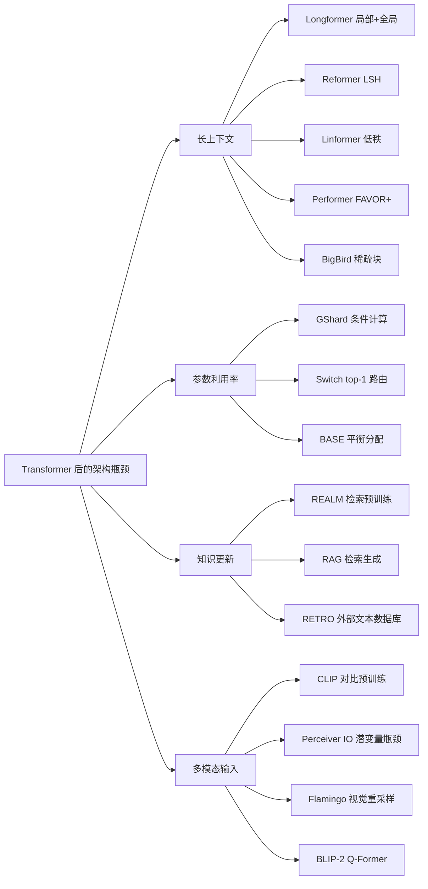
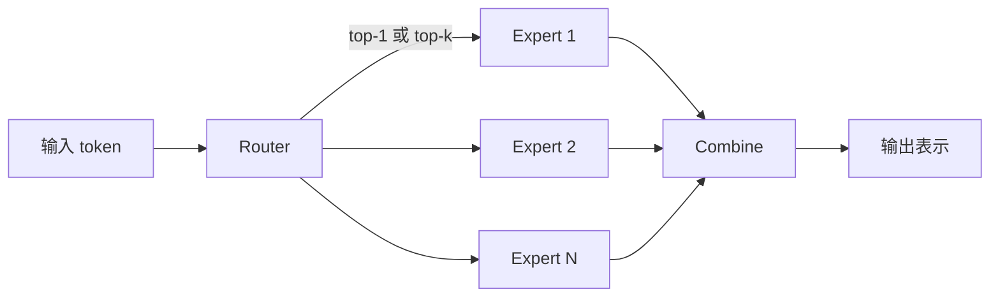
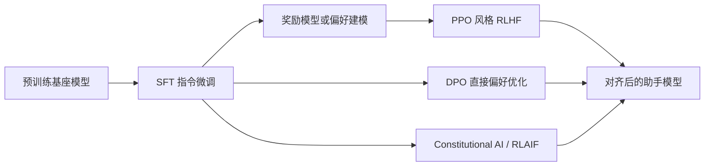

# Transformer 之后的大模型架构与训练方法创新深度研究

Transformer 之后的关键突破并非单一模型替代，而是沿着更长上下文、更高参数利用率、更强外部记忆、更成熟对齐流程，以及更低训练与微调成本五条主线并进；真正改变行业轨迹的是“架构、目标函数、系统、后训练”四者的协同演化。 citeturn0search4turn0search7turn13view2turn13view3turn20view0turn8search3

## 背景与问题定义

从 Transformer 到 GPT-3，主导范式基本可以概括为：用密集全注意力的 Transformer，在大规模文本上进行统一预训练，再依赖零样本、少样本或下游微调获取能力。Transformer 证明了纯注意力架构在机器翻译上的并行性与性能优势；GPT-1 建立了“生成式预训练 + 任务适配”的通路；GPT-2 展示了零样本泛化；GPT-3 则把“尺度本身”推成一种能力来源。与此同时，GPT-3 也把后续研究最核心的瓶颈暴露得非常清楚：全注意力的二次复杂度、知识更新困难、训练算力与显存成本高、对齐不足，以及部署与迭代昂贵。 citeturn0search4turn0search1turn0search2turn0search7

因此，Transformer/GPT-3 之后的重要创新，不应只按“模型名字”来串联，而更适合按问题轴来分析：第一，**长上下文与高效注意力**，解决二次复杂度；第二，**条件计算与稀疏专家**，提升“参数量/每步计算量”比值；第三，**检索增强与外部记忆**，把知识从参数中部分外置；第四，**训练目标与训练范式**，把 encoder-decoder、decoder-only、去噪、自回归、对比学习与指令学习统一到更系统的框架；第五，**对齐与后训练**，把模型从“会续写”变成“会执行意图”；第六，**分布式训练与高效适配**，让大模型真正可训练、可复现、可部署。 citeturn1search0turn2search1turn3search5turn5search0turn7search12turn8search1turn8search2

本文采用如下“重要创新”判据：凡是在上述任一轴上显著改变了**复杂度阶、参数利用率、数据—算力效率、可对齐性、可部署性**，并被原始论文、官方实现或后续主流大模型广泛吸收的工作，均纳入讨论。需要特别说明的是，像 GPT-4 这样影响极大的模型，其技术报告公开了能力、训练稳定性与后训练方向，但未公开完整架构、参数量、训练数据与训练配方；因此本文对 GPT-4 的分析严格限制在公开披露范围内。 citeturn14view2turn4search3

## 创新时间线总览

下表给出从 2019 到 2023 年较具决定性的创新脉络。它们并不是彼此替代，而是逐步汇合成现代大模型的“标准栈”：长上下文、稀疏路由、统一预训练、检索、对齐、分布式系统与参数高效适配共同构成今天的大模型工程现实。 citeturn9search4turn8search1turn7search12turn8search3

| 年份 | 类别 | 代表工作 | 关键作者 | 核心创新 | 代表性影响 |
|---|---|---|---|---|---|
| 2019 | 训练范式 | T5 | Colin Raffel 等 | 统一 text-to-text；encoder-decoder 大规模迁移学习 | 把任务统一到一个输入输出接口，推动 seq2seq 预训练成为标准之一。 citeturn5search0turn5search8 |
| 2019 | 训练范式 | BART | Mike Lewis 等 | 双向编码器 + 自回归解码器的去噪预训练 | 证明去噪式 seq2seq 预训练在生成与理解任务上都强。 citeturn5search1turn5search5 |
| 2019 | 系统 | Megatron-LM | Mohammad Shoeybi 等 | 张量并行训练多十亿参数 Transformer | 大模型 GPU 并行训练的基准实现之一。 citeturn8search0turn11search2 |
| 2019 | 压缩 | DistilBERT | Victor Sanh 等 | 预训练阶段知识蒸馏 | 压缩模型进入预训练主流程。 citeturn12search4 |
| 2020 | 高效注意力 | Reformer | Nikita Kitaev 等 | LSH attention + 可逆残差 | 将长序列复杂度降到近似 \(O(n\log n)\)。 citeturn1search1 |
| 2020 | 高效注意力 | Longformer | Iz Beltagy 等 | 滑窗局部注意力 + 任务相关全局注意力 | 长文档建模进入实用区间。 citeturn1search0turn13view0 |
| 2020 | 高效注意力 | Linformer / BigBird | Sinong Wang 等；Manzil Zaheer 等 | 低秩投影；局部+随机+全局稀疏 | 线性/稀疏注意力成为长上下文主支路。 citeturn1search2turn1search3 |
| 2020 | 检索增强 | REALM / RAG | Kelvin Guu 等；Patrick Lewis 等 | 可微检索预训练；检索器+生成器端到端微调 | 参数记忆与非参数记忆开始融合。 citeturn3search4turn13view3 |
| 2020 | 自监督 | ELECTRA / SpanBERT | Kevin Clark 等；Mandar Joshi 等 | 替换词检测；span 级掩码与边界目标 | 提升样本效率与 span 建模质量。 citeturn6search5turn6search2 |
| 2020 | 系统 | ZeRO | Samyam Rajbhandari 等 | 优化器状态、梯度、参数分片 | 训练万亿级参数的内存基础设施。 citeturn8search1turn8search9 |
| 2021 | 高效注意力 | Performer | Krzysztof Choromanski 等 | FAVOR+ 核近似线性注意力 | 在线性复杂度下近似 softmax attention。 citeturn2search0turn2search4 |
| 2021 | 稀疏专家 | Switch Transformer / BASE Layers | William Fedus 等；Mike Lewis 等 | top-1 路由；平衡分配专家 | MoE 从“能做”走向“能大规模稳定做”。 citeturn2search1turn2search3 |
| 2021 | 对比学习 | SimCSE / CLIP | Tianyu Gao 等；Alec Radford 等 | 句向量对比学习；图文对比学习 | “对比式预训练”成为文本表征与多模态关键路径。 citeturn6search4turn3search7 |
| 2021 | 多模态 | Perceiver IO | Andrew Jaegle 等 | 潜变量瓶颈 + 输入/输出 cross-attention | 通用多模态架构设计范式扩展。 citeturn10search0turn25search5 |
| 2021 | 高效微调 | LoRA | Edward Hu 等 | 低秩适配，冻结基座参数 | 后训练成本大幅下降。 citeturn8search2turn20view1 |
| 2021 | 指令学习 | FLAN / T0 | Jason Wei 等；Victor Sanh 等 | 多任务指令模板微调 | 指令微调成为后训练基础。 citeturn7search5turn6search3 |
| 2022 | 稀疏专家系统 | GShard | Dmitry Lepikhin 等 | 条件计算 + 自动切分 | 600B MoE 的 TPU 级大规模训练。 citeturn2search2turn2search6 |
| 2022 | 统一预训练 | UL2 | Yi Tay 等 | Mixture-of-Denoisers 统一多种目标 | 尝试统一 encoder-only、seq2seq、LM 优点。 citeturn5search2turn14view5 |
| 2022 | 对齐 | InstructGPT / Constitutional AI | Long Ouyang 等；Yuntao Bai 等 | SFT+RM+PPO 的 RLHF；RLAIF/自我批判 | “后训练”正式成为能力工程中心。 citeturn20view0turn7search11 |
| 2022 | 规模与效率 | PaLM / Chinchilla | Aakanksha Chowdhery 等；Jordan Hoffmann 等 | 540B 稠密扩展；计算最优训练法则 | 从“参数更大”转向“数据—算力配比更优”。 citeturn14view0turn17view2 |
| 2022 | 多模态 | Flamingo | Jean-Baptiste Alayrac 等 | Perceiver Resampler + gated cross-attention | 少样本视觉语言学习的代表作。 citeturn25search10turn25search21 |
| 2022 | 量化 | LLM.int8 | Tim Dettmers 等 | 8 比特推理，保留异常值通道 | 让超大模型推理更可及。 citeturn12search3 |
| 2023 | 开源大模型 | LLaMA | Hugo Touvron 等 | 公共数据高效训练；RMSNorm/SwiGLU/RoPE | 开源基座模型进入高质量时代。 citeturn4search2turn23view0 |
| 2023 | 对齐简化 | DPO | Rafael Rafailov 等 | 直接偏好优化，去掉显式奖励模型与 PPO | 简化 RLHF 管线。 citeturn7search2turn7search10 |
| 2023 | 高效微调 | QLoRA | Tim Dettmers 等 | 4 比特量化 + LoRA + NF4 | 65B 单卡 48GB 微调成为现实。 citeturn13view5turn24view2 |
| 2023 | 多模态桥接 | BLIP-2 | Junnan Li 等 | Q-Former 连接冻结视觉编码器与冻结大语言模型 | 多模态训练成本显著下降。 citeturn10search2turn10search6 |
| 2023 | 剪枝 | SparseGPT | Elias Frantar，Dan Alistarh | 一次性大模型高稀疏剪枝 | 推理压缩从“小模型”扩到百亿级 LLM。 citeturn12search2turn12search6 |
| 2023 | 代表模型 | GPT-4 | OpenAI | 多模态、可预测扩展与后训练对齐 | 披露少，但展示了现代闭源大模型的系统化路线。 citeturn14view2 |

## 架构创新

后 GPT-3 时代最显著的架构创新，集中在四个方向：**高效注意力、稀疏专家、检索增强、多模态桥接**。它们分别对应“更长上下文”“更多参数但相似 FLOPs”“更新知识而不重训全部参数”“把视觉与语言接起来”这四类现实需求。 citeturn13view0turn13view2turn13view3turn25search21

这张关系图可以理解为现代大模型架构演进的“问题树”：高效注意力先解决上下文长度；MoE 解决单位 FLOPs 的参数上限；RAG/RETRO 解决知识更新与可解释性；多模态桥接则把冻结视觉模型与冻结语言模型纳入同一系统。 citeturn1search0turn2search1turn3search5turn10search2

**高效注意力**方面，Reformer 用 LSH attention 把复杂度从 \(O(L^2)\) 改到 \(O(L\log L)\)，并用可逆残差减少激活存储；Longformer 用滑窗局部注意力加少量任务驱动的全局注意力，在长文档上实现线性扩展，并报告可建模 32K 字符、在 text8/enwik8 取得最优结果；Linformer 假设注意力矩阵低秩，用投影把时间和空间复杂度压到线性；Performer 用 FAVOR+ 随机特征近似 softmax attention，在不假设稀疏或低秩先验的情况下达成线性复杂度；BigBird 通过局部、随机、全局三种稀疏边模式，在类似硬件下把序列长度推到原先的约 8 倍。 citeturn1search1turn13view0turn1search2turn2search4turn13view1

*图：依据各论文给出的复杂度阶重绘的长上下文复杂度趋势示意。该图是“渐近复杂度”示意，不是统一实验跑分；Longformer、Linformer、Performer 与 BigBird 的关键贡献都在于把全注意力的二次增长改到近线性或线性增长。* citeturn1search1turn1search2turn2search4turn13view0turn13view1

| 模型 | 时间线 | 技术细节 | 复杂度 | 论文主结果 | 优点 | 局限 | 适用场景 |
|---|---|---|---|---|---|---|---|
| Reformer | 2020 | LSH attention；可逆残差层 | 近似 \(O(n\log n)\) | 与标准 Transformer 表现相当，但在长序列上更快、更省内存。 citeturn1search1 | 省显存显著 | 哈希路由实现复杂；近似误差依赖数据分布 | 长序列语言建模、显存受限训练 |
| Longformer | 2020 | 滑窗局部注意力 + 全局注意力；LED 扩展到 seq2seq | 线性于序列长度 | 最长可到 32K 字符；在 text8/enwik8 取 SOTA；长文档任务上持续优于 RoBERTa。 citeturn13view0turn1search12 | 工程上最实用；和预训练模型兼容性好 | 全局 token 设计依任务而变 | 长文分类、问答、摘要 |
| Linformer | 2020 | 对 K/V 做低秩投影 | 线性 | 在多项任务上接近标准 Transformer，时间空间更优。 citeturn1search2 | 理论清晰；实现相对简单 | 低秩假设不总成立 | 中长上下文、资源受限部署 |
| BigBird | 2020 | 局部 + 随机 + 全局稀疏注意力 | 线性稀疏 | 在相似硬件上支持更长序列，并提升问答与摘要。 citeturn13view1 | 长序列效果与理论都较强 | 随机块模式调参较敏感 | 长文检索、QA、摘要、基因序列 |
| Performer | 2021 | FAVOR+ 正交随机特征近似 softmax | 线性 | 提供对常规 softmax attention 的有保证近似，并在文本、图像、蛋白任务上具竞争力。 citeturn2search0turn2search4 | 理论保证强；不依赖稀疏先验 | 近似质量依赖特征数与实现细节 | 超长上下文、通用线性注意力实验 |

**稀疏专家 MoE**把“参数容量”与“每 token 计算量”解耦。标准形式可写成 \(y=\sum_{e\in \text{Top-}k} p_e(x)\,E_e(x)\)；GShard 延续早期稀疏门控专家思想，并把自动切分纳入 XLA 编译路径，使 600B 级稀疏模型在 2048 个 TPU v3 cores 上 4 天内完成训练；Switch Transformer 把路由简化为 top-1，也就是每个 token 只进一个专家，大幅降低通信与路由复杂度，并报告相对强调优 T5 基线可获得 7 倍以上预训练加速；BASE Layers 则通过平衡分配简化负载均衡，不再像许多传统 MoE 实现那样强依赖额外辅助损失。 citeturn2search6turn13view2turn2search3

Switch 的关键不是“专家更多”本身，而是“专家更多但每步激活更少”。这使得 MoE 在相同 FLOPs 下可以继续扩参数，而不会像稠密模型那样把每一步都算满。代价则是：跨设备 all-to-all 通信、专家负载不均、路由不稳定、以及专家是否真正学到可解释专长，仍然是工程与研究双重难点。 citeturn16view4turn17view4turn2search3

| 模型 | 时间线 | 技术细节 | 代表结果 | 优点 | 局限 | 适用场景 |
|---|---|---|---|---|---|---|
| GShard | 2020/2021 | 条件计算 + 自动分片；大规模多语翻译 MoE | 600B 参数，在 2048 TPU v3 cores 上约 4 天训练完成。 citeturn2search6 | 首次把巨型稀疏模型拉到可操作规模 | 系统依赖强，实现门槛高 | 超大规模多语、多任务预训练 |
| Switch Transformer | 2021/2022 | top-1 expert routing；选择性精度训练；专家正则 | 相对 T5 基线报告 7x+ 预训练提速；大稀疏模型可用 bfloat16 训练。 citeturn13view2turn16view4 | 算法最简；工程可落地 | 专家失衡与“死专家”风险仍在 | 大规模语言预训练、云端推理 |
| BASE Layers | 2021 | 平衡分配专家，简化负载均衡 | 简化稀疏层训练，并保证平衡计算负载。 citeturn2search3turn2search15 | 更稳、更少辅助超参 | 生态不如 Switch 普及 | 研究型 MoE、负载均衡要求高的场景 |

**检索增强**的共同思想是，把“存知识”从全参数内化改成“参数 + 外部索引”的混合记忆。REALM 在预训练阶段就把可微检索纳入学习过程，并在开放域问答上相对已有方法提升 4–16 个百分点；RAG 把 DPR 检索器与 BART 生成器联合起来，既可以按序列共享检索文档，也可以按 token 动态更换文档；RETRO 进一步把外部文本库扩到 2 万亿 token，并通过 chunked cross-attention 把检索到的邻近文本块注入自回归生成，报告在 Pile 上以约 25 倍更少参数取得与 GPT-3/Jurassic-1 可比的结果。 citeturn16view5turn13view3turn3search6

RAG 路线的优势非常明确：知识可更新、来源可追踪、幻觉可以通过检索证据部分压制；但它引入了新的系统瓶颈，例如索引构建、召回质量、检索延迟、训练时检索器与生成器的协同，以及证据冲突时的鲁棒性。换言之，RAG 把“知识问题”从参数规模，转移成“检索工程 + 生成控制”的联合问题。 citeturn13view3turn3search0turn3search6

| 模型 | 时间线 | 技术细节 | 代表结果 | 优点 | 局限 | 适用场景 |
|---|---|---|---|---|---|---|
| REALM | 2020 | 预训练期可微检索；大规模文档检索参与 LM 学习 | 开放域 QA 相对前方法提升 4–16% 绝对准确率。 citeturn16view5 | 检索直接进入预训练；可解释性更强 | 训练代价高，索引更新复杂 | 知识密集型 QA、事实问答 |
| RAG | 2020 | DPR + BART；Top-K 文档边缘化；可按序列或按 token 检索 | 在三项开放域 QA 上取 SOTA，并使生成更具体、更多样、更事实。 citeturn13view3 | 参数记忆与外部记忆结合自然 | 推理链更复杂；检索质量决定上限 | 企业知识库问答、检索摘要 |
| RETRO | 2022 | 冻结检索器 + chunked cross-attention + 2T token 数据库 | 用 25× 更少参数获得与 GPT-3/Jurassic-1 可比性能。 citeturn3search6 | 记忆外置化最彻底之一 | 索引极大，系统复杂度很高 | 超大知识库生成、研究型系统 |

**多模态融合**则从“把图像转成 token 喂语言模型”发展到“先把强视觉模型与强语言模型冻结，再学一个桥”。CLIP 用图文对比学习在 4 亿图文对上预训练图像编码器与文本编码器，实现零样本视觉识别；Perceiver IO 提供了潜变量瓶颈与 cross-attention 解码的通用处理框架，使输入输出规模可与原始观测解耦；Flamingo 用 Perceiver Resampler 把视觉特征压到固定长度，再在冻结语言模型内部插入 gated cross-attention 层处理交错图文序列；BLIP-2 用 Q-Former 在冻结视觉编码器与冻结 LLM 之间搭桥，并以更少可训练参数超过 Flamingo80B 的零样本 VQAv2 成绩。 citeturn3search7turn25search5turn25search21turn10search6

| 模型 | 时间线 | 技术细节 | 代表结果 | 优点 | 局限 | 适用场景 |
|---|---|---|---|---|---|---|
| CLIP | 2021 | 图文双编码器对比学习 | 在不使用 ImageNet 1.28M 标签的前提下，零样本匹配原始 ResNet-50。 citeturn3search3turn20view3 | 迁移强，范式简单 | 生成能力弱，偏检索/分类 | 视觉检索、零样本分类、多模态表征 |
| Perceiver IO | 2021 | 潜变量数组 + 输入/输出 cross-attention | 在线性输入/输出扩展下跨语言、视觉与 StarCraft 任务取得强结果。 citeturn10search0turn25search5 | 通用性强；不依赖固定 token 化 | 生态不如 Transformer 主流 | 异构模态、结构化输出 |
| Flamingo | 2022 | Perceiver Resampler + gated cross-attention；交错图文/视频输入 | 在开放式视觉语言少样本学习上取得新 SOTA。 citeturn10search1turn25search21 | 少样本能力突出；桥接冻结单模态模型 | 训练成本高；细节较复杂 | 视觉问答、图文对话、视觉助手 |
| BLIP-2 | 2023 | 两阶段预训练的 Q-Former，桥接冻结视觉编码器与冻结 LLM | 零样本 VQAv2 超过 Flamingo80B 8.7%，且可训练参数少 54 倍。 citeturn10search2turn10search6 | 成本低、可复用强 | 依赖桥模块设计与数据质量 | 成本受限的多模态训练 |

## 训练与对齐范式创新

如果说架构创新解决了“算得动、装得下、能接外部信息”，那么训练范式创新解决的是“学什么、如何迁移、怎样更像一个可用助手”。后 GPT-3 时代最重要的范式变化不是抛弃自回归，而是把**seq2seq 去噪、自监督表征、指令学习、偏好学习**系统叠加到同一模型生命周期。 citeturn5search0turn7search12turn7search2

**encoder-decoder 与 decoder-only 的分化与再统一**是这阶段的第一主线。T5 把所有 NLP 任务都改写成 text-to-text，并使用 C4 数据集做大规模 span corruption 预训练；BART 用“任意噪声 + 重建原文”的去噪自编码器，把双向编码与自回归解码放在一体；UL2 进一步提出 Mixture-of-Denoisers，把不同预训练目标看成统一框架下的特殊情形，并显示 UL2 20B 在零样本 SuperGLUE 上超过 175B GPT-3，在单样本摘要上约为 T5-XXL 的三倍。另一方面，GPT-3、PaLM、LLaMA 等 decoder-only 模型在 in-context learning、统一生成接口和大规模扩展上更自然。现代主流结论不是“谁绝对更优”，而是：**条件生成、翻译、摘要与多任务监督微调**仍经常偏向 encoder-decoder，而**开放式生成、工具使用、长链推理与统一对话接口**通常偏向 decoder-only。 citeturn14view3turn14view4turn14view5turn0search7turn22view3turn23view0

| 范式 | 代表工作 | 技术细节 | 关键结果 | 适合什么 | 不适合什么 |
|---|---|---|---|---|---|
| encoder-decoder | T5 | text-to-text；span corruption；C4 745GB；AdaFactor + inverse square root 学习率 | 在多类基准上得到强 SOTA，并系统比较数据、目标和架构。 citeturn15view3turn19view3turn19view4 | 摘要、翻译、结构化条件生成 | 统一对话接口与纯自回归推理链 |
| encoder-decoder | BART | 双向编码器 + 左到右解码器；句子打乱 + span infilling 最优 | 在 XSum 上比前作提升 3.5 ROUGE，也能匹配 RoBERTa 级理解能力。 citeturn14view4turn15view4 | 摘要、对话、生成式 QA | 超大规模纯续写生态 |
| 统一式 seq2seq | UL2 | Mixture-of-Denoisers；把多种目标混到一个预训练中 | 20B 模型零样本 SuperGLUE 超过 175B GPT-3。 citeturn14view5 | 需要兼顾多任务与推理研究 | 极致简化的部署路径 |
| decoder-only | GPT-3 / PaLM / LLaMA | 纯自回归；更自然支持 in-context learning 与统一生成 | GPT-3 建立 few-shot 标杆；PaLM 540B 与 LLaMA 系列表明该路径可持续扩展。 citeturn0search7turn22view3turn23view0 | 通用助手、代码、开放生成 | 一些强条件映射任务的样本效率 |

**自监督与对比学习**的创新，则解决了“在相同或更低算力下学到更强表征”。ELECTRA 用 replaced token detection 替代传统 MLM，在同等数据与算力下显著优于 BERT，并在更低算力下接近或超过 RoBERTa/XLNet；SpanBERT 用连续 span 掩码与 span-boundary objective 提升问答和指代消解；SimCSE 则说明即便只用 dropout 作为最小增广，也能做出高质量无监督句向量，对 STS 的平均 Spearman 有明显提升；CLIP 把对比学习扩到图文联合空间，成为后续多模态模型的共同底座。 citeturn6search5turn6search2turn6search4turn3search7

**指令微调与 RLHF**构成了现代“后训练”范式的主轴。FLAN 证明，把自然语言指令模板覆盖到 60+ 数据集的多任务混合中做 instruction tuning，能使 137B 模型在 25 个测试任务中的 20 个零样本超过 GPT-3；InstructGPT 把后训练流程拆成 SFT、奖励模型、PPO 三段，并报告 1.3B InstructGPT 在人工偏好评估中优于 175B GPT-3；Constitutional AI 进一步用一组显式原则替代部分人工偏好，形成“自我批判—自我修正—AI 反馈强化”的 RLAIF 路线；DPO 则把原来“训练奖励模型 + PPO 强化学习”的复杂管线，化简成直接在偏好对上做闭式可导优化。换言之，后训练的历史方向十分明确：**从提示工程走向指令数据，从监督对齐走向偏好对齐，从 RLHF 走向更轻量的偏好优化。** citeturn7search5turn20view0turn7search11turn7search2

InstructGPT 论文的流程非常清楚：先收集人工示范训练 SFT 模型，再收集排序数据训练奖励模型，最后用 PPO 做强化学习；同时作者还指出，把预训练分布混入 PPO（PPO-ptx）有助于减轻公共 NLP 基准的能力回退。这个观察后来几乎成为所有后训练实践的核心经验：**对齐增强不能以“破坏基座能力”为代价。** citeturn21view1turn21view2

| 方法 | 时间线 | 技术细节 | 主结果 | 优点 | 风险与成本 |
|---|---|---|---|---|---|
| FLAN | 2021 | 多任务指令模板微调 | 零样本 25 任务中 20 个超过 GPT-3；多项任务显著超其 few-shot。 citeturn7search5 | 实现简单，收益高 | 指令覆盖偏差、模板敏感 |
| InstructGPT | 2022 | SFT + RM + PPO；API 提示与人工示范混合 | 1.3B 模型在人评中优于 175B GPT-3；175B 版本被偏好 85%±3。 citeturn21view3turn20view0 | 明确把“对齐”变成管线 | 标注成本高；RL 不稳 |
| Constitutional AI | 2022 | 基于原则的自我批判、自我修订与 RLAIF | 在较少人工标签下改善无害性与透明度。 citeturn7search7turn7search11 | 人工标签需求更低 | 原则选择本身带有价值判断 |
| DPO | 2023 | 直接在偏好对上优化策略，无显式奖励模型/PPO | 在摘要与对话任务上匹配或超过 PPO 型 RLHF。 citeturn7search2turn7search10 | 简洁、稳定、便宜 | 对偏好数据质量仍很敏感 |

**代表性大模型的训练数据与算力效率洞见**，则把“规模法则”从经验观察推进为工程策略。PaLM 540B 是一个密集 decoder-only Transformer，训练于 780B 高质量 token、6144 TPU v4，并吸收了多项架构改进：SwiGLU、parallel layers、multi-query attention、RoPE、共享输入输出嵌入与去 bias；论文还指出 parallel layers 在大规模下可带来约 15% 训练加速。Chinchilla 则给出了可能是这一阶段最重要的训练法则：在固定算力预算下，最优模型规模与最优训练 token 数应几乎同比例增长，其估计指数约为 0.49 与 0.51；基于此训练的 70B Chinchilla 用与 280B Gopher 相同的算力、4 倍更多数据，在 MMLU 上达到 67.5%，比 Gopher 高 7 个多点。LLaMA 则把这套认识落到开源与公共数据世界：7B/13B 训练 1.0T token，33B/65B 训练 1.4T token，统一批大小 4M token，并采用 pre-norm RMSNorm、SwiGLU、RoPE、AdamW、余弦学习率、0.1 权重衰减等配方。GPT-4 的公开重点不在配方披露，而在“可预测扩展”和“后训练对齐”：OpenAI 报告称 GPT-4 的一些性能可由不超过其 1/1000 算力的小模型外推预测，并在模拟统一律师考试中到达前 10%。 citeturn22view0turn22view2turn22view4turn22view3turn17view1turn17view2turn13view4turn23view0turn19view2turn14view2

*图：依据 Chinchilla 论文表 3 重绘的“参数规模—计算最优训练词元”曲线。它直观表达了后 GPT-3 时代最关键的训练结论之一：在给定算力预算下，继续单纯增大参数而不相应增加训练数据，会让模型处于“欠训练”状态。* citeturn17view1turn17view2

| 模型 | 架构与训练配方 | 数据与系统 | 公开主结果 | 核心洞见 |
|---|---|---|---|---|
| PaLM 540B | decoder-only；SwiGLU、parallel layers、MQA、RoPE | 780B token；6144 TPU v4；Pathways | 在 MMLU 上比此前 SOTA 平均高约 2 分，并在 BIG-bench 多任务上显著领先 GPT-3/Gopher/Chinchilla 的共同子集评测。 citeturn22view0turn22view2turn22view3turn15view1turn15view2 | 规模继续有效，但必须由系统与架构协同支撑 |
| Chinchilla 70B | 重点是训练法则而非新块结构 | 与 Gopher 同算力、1.4T token、4× 更多数据 | MMLU 67.5，显著超过 Gopher；均衡参数与数据更优。 citeturn13view4turn17view2 | 计算最优优于盲目堆参数 |
| LLaMA | pre-norm RMSNorm、SwiGLU、RoPE、AdamW | 1.0T–1.4T token；4M token batch；公共数据 | 13B 在多数基准上超过 GPT-3 175B；65B 与 Chinchilla/PaLM 竞争。 citeturn16view0turn23view0turn19view1 | 高质量数据与配方可弥补闭源数据差距 |
| GPT-4 | 多模态 Transformer；细节未全披露 | 强调可预测扩展与后训练对齐 | 模拟统一律师考试约前 10%；小算力模型外推可预测部分性能。 citeturn14view2turn16view2 | 现代前沿能力越来越依赖后训练与系统稳定性，而不只靠预训练规模 |

## 系统优化与高效适配

没有系统创新，就没有今天的大模型。Transformer 的“可并行”只是起点；真正让百亿到万亿参数模型成为现实的，是**流水线并行、张量并行、数据并行的组合**，外加**参数/梯度/优化器状态分片、重计算、混合精度**等系统配套。GPipe 证明了大模型可通过分层流水线近线性扩展；PipeDream 进一步把流水线扩展到训练双向过程；Megatron-LM 用层内张量并行为多十亿参数 Transformer 提供了简洁而高效的 GPU 路线；ZeRO 则从数据并行视角把冗余内存分掉，极大提升可训练模型上限；FSDP 把这一思想纳入 PyTorch 官方生态；PaLM/Pathways 则展示了跨 TPU Pod 的大规模系统编排。 citeturn9search4turn9search5turn8search0turn8search1turn9search3turn22view3

| 技术 | 时间线 | 技术细节 | 代表结果或能力 | 适用场景 |
|---|---|---|---|---|
| GPipe | 2019 | 微批次流水线并行 | 在 8 个加速器上训练更大网络，并接近线性加速。 citeturn9search4 | 层次分明的大模型训练 |
| PipeDream | 2019 | 训练双向流程的流水线调度 | 提升吞吐并重叠计算与通信。 citeturn9search5 | 多机流水线训练 |
| Megatron-LM | 2019 | 张量并行；后续扩展到张量+流水线+序列并行 | 8.3B GPT 类模型用 512 GPU 训练，76% 扩展效率。 citeturn8search0turn11search2 | GPT/BERT/T5 大规模 GPU 训练 |
| ZeRO | 2020 | 参数、梯度、优化器状态分片 | 指向万亿参数级训练的内存优化。 citeturn8search1turn11search11 | 大模型显存瓶颈场景 |
| FSDP | 2022 | 官方全分片数据并行 | 官方文档明确说明可分片参数、梯度、优化器状态。 citeturn9search3turn9search7 | PyTorch 原生分布式训练 |
| Pathways | 2022 | 跨 TPU Pod 两路数据并行 + 系统编排 | PaLM 在 6144 TPU v4 上高效训练。 citeturn22view3 | 超大规模 TPU 训练 |

系统层的结论十分清楚：现代大模型训练不是选“某一种并行”，而是做**三维或四维并行的混合**。Megatron 生态如今已把张量并行、流水线并行、序列并行整合为研究与工业参考实现；DeepSpeed 则把 ZeRO、流水线并行、MoE 与推理优化纳入统一库。对于复现者而言，真正需要掌握的不是单一技巧，而是“**模型结构—通信模式—显存预算—吞吐率**”之间的耦合关系。 citeturn11search2turn11search3turn11search14

高效适配与压缩方面，后 GPT-3 时代也几乎形成完整工具链。DistilBERT 让蒸馏进入预训练主流程，模型缩小 40%、速度加快 60%、保留约 97% 的语言理解能力；Movement Pruning 说明在迁移学习场景中，一阶“权重移动方向”比单纯幅值更适合剪枝；LLM.int8 通过异常值隔离与混合精度分解，把 8 比特推理带到 175B 级模型且尽量不损失精度；SparseGPT 则把一次性高稀疏剪枝带到 OPT-175B/BLOOM-176B，报告 50% 以上稀疏率仍只带来很小精度损失；LoRA 用低秩矩阵替换全量参数更新，训练参数可降 10,000 倍、显存约降 3 倍；QLoRA 进一步用 NF4、double quantization 与 paged optimizers，把 65B 微调压到单张 48GB GPU。 citeturn12search4turn12search1turn12search3turn12search2turn20view1turn13view5

| 方法 | 技术细节 | 代表结果 | 优点 | 风险/代价 | 典型场景 |
|---|---|---|---|---|---|
| DistilBERT | 预训练知识蒸馏 + 三重损失 | 40% 更小、60% 更快、保留约 97% 能力。 citeturn12search4 | 部署友好 | 上限受教师模型限制 | 边缘部署、轻量服务 |
| Movement Pruning | 按 fine-tuning 中权重“移动趋势”剪枝 | 高稀疏区间优于幅值剪枝。 citeturn12search1turn12search5 | 对迁移学习更友好 | 稀疏推理硬件支持有限 | 模型压缩研究 |
| LLM.int8 | 8 比特矩阵乘 + 异常值分离 | 175B 可 8 比特推理，显存减半且尽量不降性能。 citeturn12search3 | 推理幅度降本 | 主要针对推理，不是完整训练 | 大模型服务化推理 |
| SparseGPT | 一次性大模型剪枝 | OPT-175B/BLOOM-176B 可达 50% 以上稀疏。 citeturn12search2turn12search10 | 不需重训或少重训 | 稀疏计算收益依赖硬件 | 离线压缩、研究原型 |
| LoRA | 冻结底座，只训练低秩增量 | 训练参数可降 10,000 倍，且通常不增推理延迟。 citeturn20view1turn11search1 | 最实用的参数高效微调 | rank、target modules 需调参 | 私有领域微调、持续迭代 |
| QLoRA | 4-bit 基座 + LoRA + NF4 + DQ + paged optimizer | 65B 可单张 48GB GPU 微调；NF4 基本匹配 16-bit LoRA。 citeturn13view5turn24view2turn24view4 | 成本极低 | 序列超长时分页开销、稳定性更敏感 | 中小团队微调、多版本并行实验 |

## 复现实验配置建议

以下配置假设**用户未指定额外约束**，因此默认目标是：优先复现“关键机制”而不是追求原论文同规模；硬件默认以 NVIDIA A100/H100 或 TPU v3/v4 为参考；数值精度优先选择 bf16，其次 fp16；若做低成本后训练，则优先选择 QLoRA 路线。所有“精确超参”优先引用原论文或官方实现；若原论文未披露，则以下表格给出**保守、工程可行的综合建议**，并已明确标注为综合建议。 citeturn1search12turn11search2turn11search3turn8search15

| 复现实验 | 目标 | 数据规模建议 | 关键超参建议 | 位宽与并行 | 硬件建议 | 依据 |
|---|---|---|---|---|---|---|
| 长上下文稀疏注意力 | 复现 Longformer/BigBird/Performer 的扩展性 | 10B–100B token 的长文语料；上下文 2K–16K | AdamW；lr 1e-4–3e-4；warmup 1k–4k；全局 batch 0.5M–2M token；梯度检查点必开 | bf16/fp16；序列并行或 checkpointing | 8×80GB A100 起步；若做 LED 16K，48GB 显存+fp16+checkpoint 可行 | Longformer 论文与官方仓库明确给出线性扩展与 16K 级 LED 实践。 citeturn13view0turn1search12 |
| 稀疏专家 MoE | 验证 Switch/GShard 的计算效率 | 50B–300B token；先从 1B–7B 稠密骨干 + 8/16/32 专家入手 | top-1 路由优先；加负载均衡或平衡分配；路由器学习率略低于主干；逐步增专家数 | bfloat16 优先；张量并行 + all-to-all 通信优化 | 32–256 GPU/TPU 更合适 | Switch 证明 top-1 与 bfloat16 可行；GShard 证明系统切分是关键。 citeturn13view2turn2search6 |
| 检索增强生成 | 复现 RAG/REALM 基本收益 | 以 Wikipedia 段落库或企业知识库作为索引；训练集可从开放 QA 起步 | Top-K 取 5–20；先冻结或半冻结检索器；FAISS/HNSW/MIPS；序列长度 512–2K | 检索器 fp16/bf16；索引放 CPU 内存或独立向量库 | 8×A100 或 1–2 节点 CPU+GPU 混合 | RAG 的核心是 DPR+BART 的端到端联合；REALM 则强调预训练期检索。 citeturn13view3turn16view5 |
| T5/UL2 类统一 seq2seq 预训练 | 复现 encoder-decoder 范式 | C4 子集或清洗后的 Common Crawl；可从 50B token 起步 | AdaFactor；inverse square root schedule；预训练 batch 可按 2^16 token 量级起步；warmup 1e4 | bf16 优先 | TPU 或 A100 集群 | T5 论文公开了 AdaFactor、inverse-square-root、warmup 与 batch 设定。 citeturn19view3turn19view4 |
| LLaMA/PaLM 类 decoder-only 基座 | 做高质量开源基线 | 若追求论文风格，token 数应至少接近参数量数量级以上，最好百亿到万亿级；小规模研究可从 50B–200B token 起步 | AdamW；β1=0.9，β2=0.95；weight decay 0.1；cosine；warmup 2k；梯度裁剪 1.0；批大小尽量按 token 预算而非样本数控制 | bf16；张量并行 + ZeRO/FSDP | 8×80GB 到多节点 H100/A100 | LLaMA 公开了该完整优化器配方与 4M token 大 batch；PaLM 则展示了 MQA、parallel layers 的价值。 citeturn19view1turn19view2turn22view0turn22view2turn22view4 |
| 指令微调 | 建立可用助手基线 | 50k–500k 条高质量指令数据；先于更大、嘈杂数据集 | 全量 SFT：lr 1e-5–5e-5；LoRA：lr 1e-4–2e-4；序列长度 2K–8K | 全量 SFT 用 bf16；LoRA/QLoRA 用 16-bit 适配器 + 4-bit 基座 | 7B 模型 1×48GB 可 QLoRA；13B/33B 更建议多卡 | FLAN、InstructGPT 与 QLoRA 都显示“数据质量 > 粗暴堆量”。 citeturn7search5turn20view0turn13view5 |
| 偏好优化 | 复现 DPO 或 RLHF | 50k–200k 偏好对通常已能看见收益 | DPO 优先于 PPO；β 按 0.1–0.5 起扫；保留 SFT 参考模型；防止分布漂移 | bf16；小 batch + grad accumulation | 4–8×80GB A100 较稳 | DPO 明确强调其稳定、轻量并减少超参搜索；InstructGPT 则证明 PPO-ptx 可缓解能力退化。 citeturn7search10turn21view2 |
| 参数高效微调 | 低成本适配领域任务 | 10k–100k 条标注或指令数据即可 | LoRA rank 8–64；alpha 通常 16–128；优先加在 q_proj/v_proj 或所有线性层；dropout 0–0.1 | 16-bit LoRA 或 4-bit QLoRA | 单卡到 8 卡皆可 | LoRA 论文指出很低秩即可有效；QLoRA 的 NF4+DQ 基本恢复 16-bit 效果。 citeturn24view1turn24view2turn24view4 |

复现时最值得遵守的经验，不是某个“神奇超参”，而是以下三点。第一，**按 token 预算管理训练**，而不是只盯参数量；Chinchilla 与 LLaMA 都说明数据—算力—模型的配平比单纯堆大更重要。第二，**预训练与后训练解耦**：先把基座能力训稳，再做 SFT/偏好优化；否则很容易把基座能力“对齐掉”。第三，**先复现机制，再扩规模**：例如先用 8 专家验证路由，再上 64 专家；先用 2K/4K 上下文验证稀疏注意力，再扩到 16K/32K；先用 LoRA/DPO 路线跑通后训练，再决定是否投入 RLHF。 citeturn17view2turn21view2turn13view2

官方或准官方实现方面，建议把 **Megatron-LM、DeepSpeed、Longformer、BigBird、CLIP、LoRA、QLoRA、SimCSE** 作为第一层复现入口：Megatron-LM 适合大规模分布式基线，DeepSpeed 适合 ZeRO/FSDP 风格内存优化，Longformer/BigBird 适合长上下文实验，LoRA/QLoRA 与 SimCSE 最适合低成本后训练与表征实验，CLIP 则是多模态对比学习的标准起点。 citeturn11search2turn11search3turn1search12turn1search15turn20view3turn11search1turn8search15turn20view2

## 未来研究方向与开放问题

第一类开放问题是**长上下文的“真实性能”**。把复杂度从 \(O(n^2)\) 降下来并不等于真正获得稳定的长程推理能力；许多方法在长序列分类、检索或摘要上有效，但在跨段推理、工具调用、多跳证据整合上依然受限。Longformer、BigBird、Performer 等工作证明了“能算更长”，但真正的研究难题已经转向：**能否在更长上下文下保持信息选择、证据压缩与推理链稳定，而不是只增加可见 token 数**。 citeturn13view0turn13view1turn2search4

第二类开放问题是**MoE 的可解释性与系统收益是否一致**。GShard 与 Switch 证明了稀疏专家可以把参数规模推得更高，但“专家是否学出真正可迁移的专长”“route collapse 如何度量”“通信代价何时抵消理论 FLOPs 优势”仍不够清楚。尤其在现代 GPU 集群中，all-to-all 通信和专家不均衡经常决定 MoE 是否划算，这意味着未来 MoE 研究将越来越像“算法—网络系统—编译器”协同设计问题，而不只是神经网络结构问题。 citeturn2search6turn13view2turn2search3

第三类开放问题是**检索增强到底应当“多深地进入模型”**。REALM 把检索推到预训练，RAG 把检索与生成联合微调，RETRO 则把大规模外部文本库变成近似长期记忆。三者共同证明外部记忆有价值，但仍未解决索引更新、召回偏差、检索延迟、引文一致性、以及检索失败时的鲁棒退化。未来很可能出现更强的“训练时检索 + 推理时检索 + 工具使用”统一栈，而不是单一 RAG 模块。 citeturn16view5turn13view3turn3search6

第四类开放问题是**后训练的科学化**。InstructGPT、Constitutional AI 与 DPO 已经把后训练从经验技巧发展为独立研究方向，但数据分布偏差、偏好标注的一致性、奖励黑客、模型在安全性与有用性之间的权衡，仍未被系统解决。GPT-4 技术报告特别强调了“跨尺度可预测性”和“后训练提高事实性与期望行为遵循”，这提示未来前沿模型的关键竞争力可能更多来自后训练系统，而非预训练单点突破。 citeturn20view0turn7search11turn7search10turn14view2

第五类开放问题是**公开性与可复现性**。PaLM、Chinchilla、LLaMA 给学界留下了相对清楚的训练或扩展线索，但 GPT-4 这样的前沿闭源模型只披露结果、少披露具体做法。这会带来一个长期张力：产业前沿能力越来越仰赖闭源系统、数据与后训练资产，而学术研究需要可复检、可解释、可比较的公开配方。未来高质量研究的一个重要方向，不只是提出新模型，还包括建立更可信的评测、开放更细的消融报告，并用主流开源基线尽量缩小闭源知识差。 citeturn22view3turn17view2turn23view0turn14view2

综合来看，Transformer、GPT-1/2/3 之后最重要的变化并不是“又出现了一个更大的 Transformer”，而是研究社区逐步认识到：**真正决定现代大模型上限的，是架构、目标、数据配比、外部记忆、对齐流程与训练系统的共设计**。长上下文方法、MoE、RAG、统一预训练、指令微调、RLHF/DPO、LoRA/QLoRA 与分布式系统优化，并不是彼此分离的专题，而是今天任何强大基座模型都绕不开的共性部件。 citeturn13view0turn13view2turn13view3turn14view5turn20view0turn8search2turn8search3turn11search2turn11search3