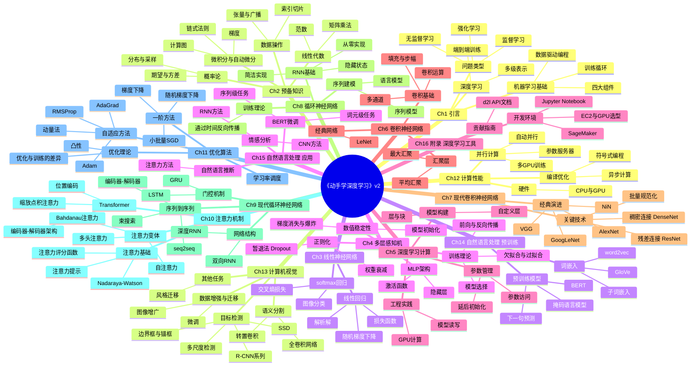
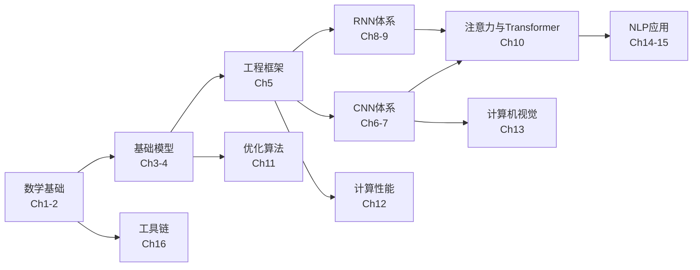

# 全书知识地图

> 以 Mermaid mindmap 展示《动手学深度学习》v2 全部 16 章核心主题，三层深度，仅保留关键概念。

## 全书总览脑图

```mermaid
mindmap
  root((《动手学深度学习》v2))
    Ch1 引言
      机器学习基础
        数据驱动编程
        训练循环
        四大组件
      问题类型
        监督学习
        无监督学习
        强化学习
      深度学习
        多级表示
        端到端训练
    Ch2 预备知识
      数据操作
        张量与广播
        索引切片
      线性代数
        矩阵乘法
        范数
      微积分与自动微分
        梯度
        链式法则
        计算图
      概率论
        分布与采样
        期望与方差
    Ch3 线性神经网络
      线性回归
        损失函数
        解析解
        随机梯度下降
      softmax回归
        交叉熵损失
        图像分类
    Ch4 多层感知机
      MLP架构
        隐藏层
        激活函数
      正则化
        权重衰减
        暂退法 Dropout
      训练理论
        欠拟合与过拟合
        模型选择
        前向与反向传播
      数值稳定性
        梯度消失与爆炸
        模型初始化
    Ch5 深度学习计算
      模型构建
        层与块
        自定义层
      参数管理
        参数访问
        延后初始化
      工程实践
        模型读写
        GPU计算
    Ch6 卷积神经网络
      卷积基础
        卷积运算
        填充与步幅
        多通道
      汇聚层
        最大汇聚
        平均汇聚
      经典网络
        LeNet
    Ch7 现代卷积神经网络
      经典演进
        AlexNet
        VGG
        GoogLeNet
        NiN
      关键技术
        批量规范化
        残差连接 ResNet
        稠密连接 DenseNet
    Ch8 循环神经网络
      序列建模
        序列模型
        语言模型
      RNN基础
        隐藏状态
        从零实现
        简洁实现
      训练理论
        通过时间反向传播
    Ch9 现代循环神经网络
      门控机制
        GRU
        LSTM
      网络结构
        深度RNN
        双向RNN
      序列到序列
        编码器-解码器
        seq2seq
        束搜索
    Ch10 注意力机制
      注意力基础
        注意力提示
        注意力评分函数
        Nadaraya-Watson
      注意力变体
        Bahdanau注意力
        多头注意力
        自注意力
      Transformer
        位置编码
        编码器-解码器架构
        缩放点积注意力
    Ch11 优化算法
      优化理论
        凸性
        优化与训练的差异
      一阶方法
        梯度下降
        随机梯度下降
        小批量SGD
      自适应方法
        动量法
        AdaGrad
        RMSProp
        Adam
      学习率调度
    Ch12 计算性能
      编译优化
        符号式编程
        异步计算
      并行计算
        自动并行
        多GPU训练
        参数服务器
      硬件
        CPU与GPU
    Ch13 计算机视觉
      数据增强与迁移
        图像增广
        微调
      目标检测
        边界框与锚框
        多尺度检测
        SSD
        R-CNN系列
      语义分割
        转置卷积
        全卷积网络
      其他任务
        风格迁移
    Ch14 自然语言处理 预训练
      词嵌入
        word2vec
        GloVe
        子词嵌入
      预训练模型
        BERT
        掩码语言模型
        下一句预测
    Ch15 自然语言处理 应用
      情感分析
        RNN方法
        CNN方法
      自然语言推断
        注意力方法
      BERT微调
        序列级任务
        词元级任务
    Ch16 附录 深度学习工具
      开发环境
        Jupyter Notebook
        SageMaker
        EC2与GPU选型
      贡献指南
        d2l API文档
```

## 知识脉络概要

```mermaid
flowchart LR
  A["数学基础<br/>Ch1-2"] --> B["基础模型<br/>Ch3-4"]
  B --> C["工程框架<br/>Ch5"]
  C --> D["CNN体系<br/>Ch6-7"]
  C --> E["RNN体系<br/>Ch8-9"]
  D --> F["注意力与Transformer<br/>Ch10"]
  E --> F
  F --> G["NLP应用<br/>Ch14-15"]
  D --> H["计算机视觉<br/>Ch13"]
  B --> I["优化算法<br/>Ch11"]
  C --> J["计算性能<br/>Ch12"]
  A --> K["工具链<br/>Ch16"]
```
