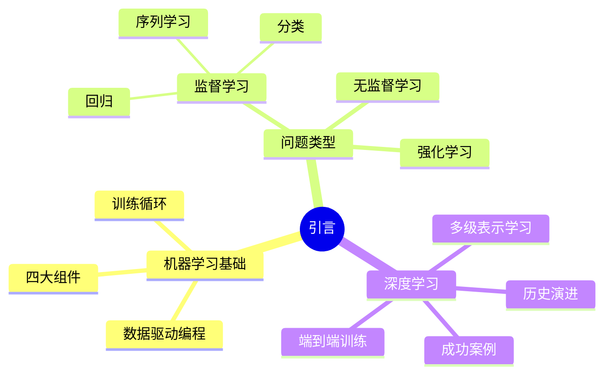

# 引言

## 脑图

## 背景

传统编程要求开发者用**显式规则**描述业务逻辑，但现实世界中大量任务——语音识别、图像理解、自然语言处理——无法用规则穷举。**机器学习**提出了一种根本性的范式转换：用**数据**代替规则来编程。随着互联网积累了**海量数据**，GPU提供了**廉价算力**，深度学习作为机器学习的子领域在2010年代后强势复苏，推动了从语音识别到围棋博弈等一系列突破。

## 问题

- 如何让机器从**数据**中自动发现规律，而非依赖人工编写规则？
- 面对**回归**、**分类**、**序列预测**等不同任务，统一的学习框架是什么？
- 模型在训练集表现好却在新数据上失败（**过拟合**），如何衡量和保障**泛化**能力？
- 神经网络为何在此前沉寂多年后重新崛起？**数据**和**算力**扮演了什么角色？
- 深度学习与传统机器学习方法的本质区别在哪里？

## 解决方案

### 从"规则编程"到"数据编程"

机器学习的核心思想是定义一个包含**可调参数**的灵活模型族，再用数据集自动确定最优参数。这一过程遵循固定循环：**随机初始化参数** -> 获取数据样本 -> 计算损失并**调整参数** -> 重复直到收敛。与传统编程的根本区别在于，程序的行为由**数据**而非程序员的逻辑决定。

### 四大核心组件

所有机器学习问题都可拆解为四个组件：

| 组件 | 作用 | 关键特性 |
|------|------|----------|
| **数据** | 提供学习素材 | 样本通常**独立同分布**；数据质量直接决定模型上限 |
| **模型** | 表达输入到输出的映射 | 深度学习通过**神经网络层叠**构建多层次表示 |
| **目标函数** | 量化模型表现 | 训练集用于拟合，测试集用于评估**泛化** |
| **优化算法** | 搜索最优参数 | **梯度下降**沿损失减小方向迭代更新参数 |

### 机器学习问题分类

**监督学习**是最重要的范式：每个样本附带**真实标签**，目标是学习输入到标签的映射。其下分为：

- **回归**：输出连续数值（如房价、住院时长），核心问题是"有多少"
- **分类**：输出离散类别，关键在于输出**概率**以表达不确定性，并在决策时权衡**风险**
- **序列学习**：输入输出均为**变长序列**（如机器翻译），核心挑战是输入输出长度不对齐

**无监督学习**在无标签数据中发现结构（聚类、降维、生成）。**强化学习**中，**智能体**通过与环境交互，在**观察-动作-奖励**循环中学习策略，面临**探索与利用**的权衡。

### 深度学习的多级表示

深度学习的核心方法论是**多级表示学习**：每一层网络对数据进行一次变换，低级层捕获**细节特征**（如边缘、纹理），高级层捕获**抽象概念**（如物体部件、语义）。与传统方法的关键区别是**端到端训练**——整个系统联合优化，取代了手工设计的特征工程（如Canny边缘检测、SIFT特征）。

### 历史演进与复兴

神经网络经历了从兴起到沉寂再到复兴的历程。早期的**赫布学习**思想（"一起激活的神经元连接增强"）奠定了现代梯度下降的原型。关键原则是**线性与非线性层交替**，并通过**链式法则（反向传播）**整体调整参数。1995-2005年间因**算力昂贵**和**数据稀缺**而陷入低谷。复兴的驱动力是互联网时代的**大规模数据**和GPU带来的**廉价并行算力**。

## 效果

**数据驱动范式的成功**是根本性的改变：深度学习在多个领域达到甚至超越人类水平——语音识别精度匹敌人类，ImageNet图像分类Top-5错误率从28%降至**2.25%**，AlphaGo击败围棋世界冠军。更深层的影响在于：

- **手工特征工程被取代**：端到端训练让系统自动学习最优特征表示，大幅降低了领域专家的参与门槛
- **算力成为核心驱动力**：ResNet-50在ImageNet上的训练时间从数天缩短到**不到7分钟**，算力增长已超越数据增长
- **开源共享加速进步**：从Caffe/Theano到TensorFlow/PyTorch，框架的演进不断降低深度学习的实现门槛
- **非凸优化的务实态度**：深度学习接受**次优解**——先用经验方法跑通，再用理论分析，这种"先尝试再证明"的风格推动了工程实践的快速迭代

这些改变共同表明：当**数据充足**、**算力廉价**、**模型灵活**三者同时具备时，深度学习能够解决此前被认为不可编程的复杂问题。
