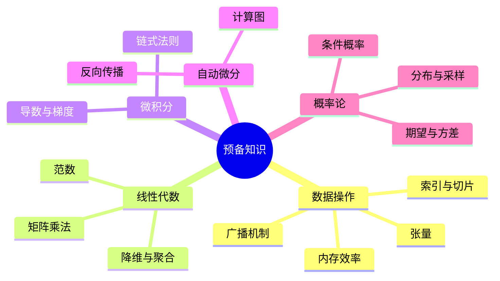

# 预备知识

## 脑图

## 背景

深度学习的核心任务是从数据中学习模式并做出预测。这要求一套完整的基础设施：**张量**作为数据的载体，**线性代数**作为变换的语言，**微积分**提供优化的方向，**自动微分**将微分从手工劳动变为自动化流程，**概率论**量化预测中的不确定性。这五个支柱共同构成了深度学习的数学与计算地基——没有它们，后续的一切模型设计都无从谈起。

## 问题

- 如何高效存储和操作大规模多维**数据**？
- 神经网络层与层之间的变换本质是什么？如何用**线性代数**描述？
- 训练模型时，如何知道每个**参数**该往哪个方向调整？
- 深度网络由数百层复合函数组成，如何**自动计算**其梯度？
- 模型预测存在不确定性，如何用**概率**框架量化和处理？

## 解决方案

### 张量：统一的数据容器

**张量**是深度学习中的基本数据结构——一个可以有任意维度的数组。它统一了从标量（0维）到向量（1维）、矩阵（2维）乃至更高维度数据的表示。相比 NumPy 数组，深度学习框架的张量额外支持 **GPU 加速**和**自动微分**，使其既是数据容器，也是计算图的节点。

**广播机制**是张量操作的关键设计：当两个形状不同的张量进行运算时，框架自动沿长度为1的维度复制元素使其匹配，无需手动扩展。这让代码既简洁又高效。

**内存效率**在训练中至关重要。参数会在数千次迭代中反复更新，原地操作（in-place operation）避免了不必要的内存分配，是工程实践中的重要考量。

### 线性代数：变换的通用语言

深度学习模型的每一层本质上是一次**矩阵乘法**（加上非线性激活）。矩阵-向量积实现了从输入空间到输出空间的映射，多层网络通过反复执行这种变换，将原始数据逐步转化为预测结果。

**范数**（L1、L2、Frobenius 等）在深度学习中承担双重角色：衡量向量的"大小"，以及构建优化目标。损失函数的设计本质上就是最小化某种范数——预测值与真实值之间的"距离"。

**降维操作**（沿轴求和、求均值）将高维信息压缩为低维表示，这一思想贯穿于池化、注意力机制等核心组件。

### 微积分：优化的引擎

训练模型就是最小化**损失函数**。微积分为此提供了核心工具：

- **导数**衡量损失对参数变化的敏感度
- **偏导数**在多参数场景下隔离单个参数的影响
- **梯度**（所有偏导数组成的向量）指向函数增长最快的方向，其反方向就是优化方向
- **链式法则**将复合函数的导数分解为简单导数的乘积，这是神经网络反向传播的数学基础

梯度下降的本质就是：计算梯度，沿反方向迈步，重复，直到损失足够小。

### 自动微分：从手工到自动化

手动对深度网络求导既繁琐又容易出错。**自动微分**通过构建**计算图**解决这个问题：前向传播时记录所有运算形成图结构，反向传播时沿图逆序遍历，自动计算每个参数的梯度。

关键特性：

- **精确性**：不同于数值微分的近似，自动微分计算的是精确梯度
- **动态图**：标准 Python 控制流（循环、条件判断）不会破坏梯度计算，因为计算图在每次执行时动态构建
- **梯度分离**：可以阻断部分计算路径的梯度流，实现灵活的训练策略（如冻结某些层）

### 概率论：不确定性的数学

现实世界的预测本质上是不确定的。概率论提供了量化这种不确定性的严格框架：

- **随机变量与分布**描述数据生成过程的随机性
- **条件概率与贝叶斯定理**实现变量间的推理——即使检测准确率很高，若事件本身罕见，阳性结果的实际意义也可能远低于直觉预期
- **期望**是损失函数设计的核心：优化的本质就是最小化期望损失
- **方差**衡量预测的稳定性，直接关联模型的泛化能力
- **条件独立假设**将复杂联合分布分解为更小因子的乘积，大幅简化计算

## 效果

这五个领域的协同作用带来了根本性的改变：

**数据操作**使模型能够处理任意规模和维度的真实数据，从一维文本到三维视频，统一在张量这一抽象之下。

**线性代数**将神经网络的"智能"还原为可计算的矩阵运算，使得 GPU 并行加速成为可能——现代深度学习的效率根基正在于此。

**微积分与自动微分**的结合，将模型训练从"调参艺术"变为可系统化优化的工程问题。**梯度**提供了明确的改进方向，**自动微分**消除了实现的门槛，两者共同构成了深度学习可训练的基石。

**概率论**使模型不仅能给出预测，还能表达对预测的**置信程度**。这是从"黑盒输出"到"可信赖决策"的关键一步。

掌握这五块预备知识，就获得了理解后续所有深度学习模型的共同语言。
