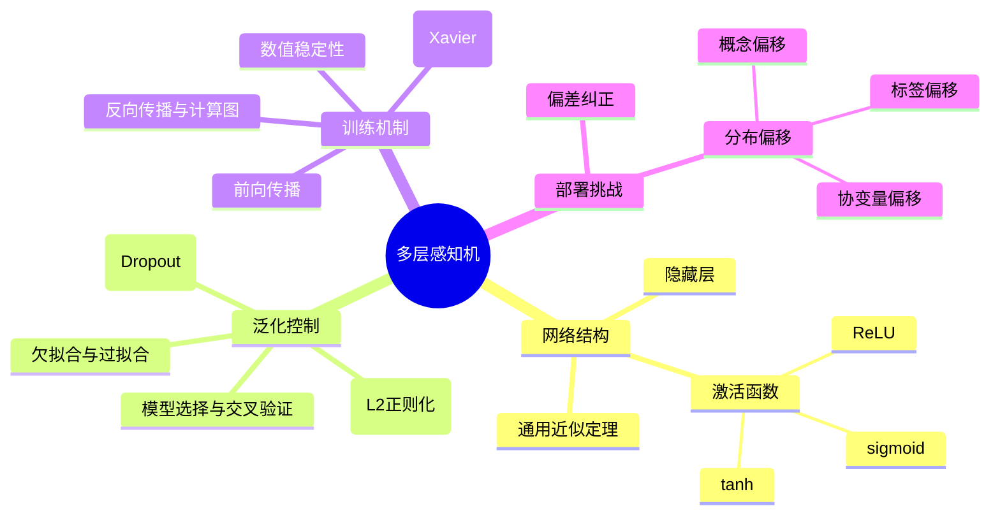

# 多层感知机

## 脑图

## 背景

线性模型（如softmax回归）通过单一仿射变换将输入直接映射到输出，其根本局限在于**线性意味着单调假设**——任何特征的变化只能单调地影响输出。然而现实世界中的模式本质上是非线性的：图像中某个像素的重要性取决于周围像素的上下文，疾病的风险因素之间存在复杂的交互效应。为了让神经网络突破线性模型的表达天花板，研究者在输入和输出之间引入了**隐藏层**和**非线性激活函数**，由此诞生了**多层感知机（MLP）**。与此同时，更深的网络结构带来了训练稳定性、泛化控制和部署可靠性等一系列新挑战，本章正是围绕这些挑战展开。

## 问题

- 线性模型无法捕捉特征间的**非线性交互**，表达能力存在结构性天花板
- 模型容量过大时如何避免**过拟合**，容量过小时如何避免**欠拟合**
- 深层网络中信号逐层传递会导致**梯度消失**或**梯度爆炸**，如何保证训练稳定
- 训练时的**前向传播**和**反向传播**如何协同工作，梯度如何高效计算
- 模型部署后面对**分布偏移**，训练环境与真实环境不一致时如何应对

## 解决方案

### 从线性到非线性：隐藏层与激活函数

线性模型的根本问题不在于参数不足，而在于模型类别本身无法表达非线性关系。MLP通过在输入和输出之间堆叠一个或多个**全连接隐藏层**来解决这个问题。但仅有隐藏层是不够的——仿射函数的仿射函数仍然是仿射函数，没有**非线性激活函数**，多层网络在数学上等价于单层线性模型。

激活函数将线性组合器变为**通用函数逼近器**。三种主流激活函数各有定位：

| 激活函数 | 核心特性 | 当前定位 |
|---------|---------|---------|
| **ReLU** | max(0,x)，正区间梯度恒为1，负区间直接丢弃 | 隐藏层默认选择，有效缓解梯度消失 |
| **sigmoid** | 压缩到(0,1)，梯度在极端值处趋近于零 | 主要用于二分类输出层 |
| **tanh** | 压缩到(-1,1)，关于原点对称 | 性质类似sigmoid，隐藏层中已较少使用 |

**通用近似定理**保证：即使是单隐藏层，给定足够的神经元就能逼近任意函数。但实践中**更深的网络比更宽的单层网络更容易逼近目标函数**。

### 泛化控制：在训练误差与验证误差之间寻找平衡

模型的核心挑战不是拟合训练数据，而是**泛化到未见过的数据**。泛化误差无法精确计算，只能通过独立测试集来估计。

影响泛化的三个关键因素：**可调参数数量**（越多越容易过拟合）、**参数取值范围**（越大越容易过拟合）、**训练样本数量**（越少越容易过拟合）。

模型选择时使用**验证集**而非测试集来调参，避免对测试数据的隐性过拟合。数据稀缺时采用**K折交叉验证**，将数据分成K份轮流训练验证，取平均结果。

### 正则化技术一：权重衰减

权重衰减通过在损失函数中加入权重的**L2范数惩罚项**，从"最小化预测损失"变为"最小化预测损失与权重范数之和"。正则化常数λ控制权衡：λ=0恢复原始损失，λ越大对权重约束越强。

其本质是提供一种**连续的机制来调节函数复杂度**——权重每步更新时都主动向零衰减。实验表明，无权重衰减时权重L2范数可达13，加入后降至0.35，测试误差显著下降。

**L2正则化**使权重在大量特征上均匀分布，对观测误差更稳定；**L1正则化**将权重集中在少数特征上，实现特征选择。

### 正则化技术二：暂退法（Dropout）

Dropout的思想来自一个关键洞见：**对输入施加噪声等价于正则化**。Bishop在1995年证明了这一等价关系，Srivastava等人将其推广到网络内部层。

训练时每个神经元以概率p被随机置零，效果是每次前向传播实际上在训练一个**不同的子网络**。输出层不能过度依赖任何单一神经元，从而破坏神经元之间的"共适应性"。这相当于对**指数级数量的子网络进行隐式集成**，显著提升模型稳健性。仅在训练时使用，测试时不丢弃任何节点。

### 训练机制：前向传播与反向传播

**前向传播**按顺序从输入层到输出层计算和存储每层结果。**反向传播**利用**链式法则**沿计算图从输出层向输入层反向遍历，计算目标函数对每个参数的梯度。两者方向完全相反，但相互依赖——反向传播复用前向传播存储的中间值来计算梯度，避免重复计算。

这解释了为什么训练比预测需要**更多内存**：中间值的大小与网络深度和批量大小成正比。

### 数值稳定性：梯度消失、梯度爆炸与参数初始化

深层网络面临两大威胁。**梯度消失**：sigmoid等函数在极端值处梯度趋近于零，多层连乘后梯度急剧缩小，参数几乎无法更新。**梯度爆炸**：多层矩阵连乘可能导致数值极端放大，100个方差为1的随机矩阵相乘后元素可达10^23量级。

此外，若所有参数初始化为相同值，各隐藏单元永远无法分化，网络等效于单个隐藏单元——**随机初始化是打破对称性的关键**。

**Xavier初始化**通过控制权重方差为σ²=2/(n_in+n_out)，使前向和反向传播中信号的方差保持稳定，在两个方向的约束之间取得平衡。

### 部署挑战：分布偏移

模型在训练集上学到的规律，在部署环境中可能因**分布偏移**而失效。三种主要类型：

| 偏移类型 | 含义 | 纠正策略 |
|---------|------|---------|
| **协变量偏移** | 输入分布变化，P(y\|x)不变 | 重要性加权：估计目标与源分布的密度比来调整训练损失 |
| **标签偏移** | 标签边缘概率P(y)变化，P(x\|y)不变 | 利用混淆矩阵估计目标标签分布（标签空间低维，更易估计） |
| **概念偏移** | 标签定义本身发生变化 | 持续用新数据更新网络权重 |

更深层的危险在于**反馈循环**：模型预测可能通过改变环境来自我强化。预测性警务导致特定社区被过度巡逻、更多犯罪被发现、进一步加强偏见——这是从预测到决策转变中必须警惕的伦理风险。

## 效果

**非线性激活函数使神经网络从线性分类器变为通用函数逼近器**，这是深度学习能够处理现实世界复杂模式的根本前提。

正则化技术（权重衰减和Dropout）提供了一套从"记住数据"到"发现规律"的调控手段。权重衰减通过**连续调节权重幅度**来控制模型复杂度；Dropout通过**隐式集成大量子网络**来提升稳健性。两者通常结合使用。

Xavier初始化和ReLU激活函数的配合，使得**训练数千层的深度网络成为可能**，无需额外架构技巧。信号方差在各层间保持稳定，梯度既不消失也不爆炸。

分布偏移的理论框架让我们认识到：**经验风险最小化是对真实风险的近似，而分布偏移使这种近似失效**。在协变量偏移和标签偏移的假设条件下，偏移可在测试时检测和纠正，但部署时必须持续监控。

## 核心框架

| 概念 | 作用 | 关键特性 |
|-----|------|---------|
| **隐藏层 + 激活函数** | 突破线性模型表达天花板 | 非线性是关键转折点；ReLU为默认选择 |
| **通用近似定理** | 理论保证MLP的表达能力 | 单隐层即可逼近任意函数，但深度优于宽度 |
| **训练误差 vs 泛化误差** | 区分"记住数据"与"发现规律" | 泛化误差无法精确计算，只能通过测试集估计 |
| **权重衰减** | 连续调节模型复杂度 | L2惩罚使权重均匀分布；λ控制正则化强度 |
| **Dropout** | 隐式集成，破坏共适应性 | 仅训练时使用；相当于正则化的噪声注入视角 |
| **前向/反向传播** | 高效计算梯度的双向机制 | 计算图使梯度计算模块化；内存开销与深度成正比 |
| **Xavier初始化** | 保持信号方差稳定 | 折中前向与反向传播的方差约束 |
| **分布偏移** | 训练与部署环境不一致的系统性风险 | 协变量偏移可通过重要性加权纠正 |
