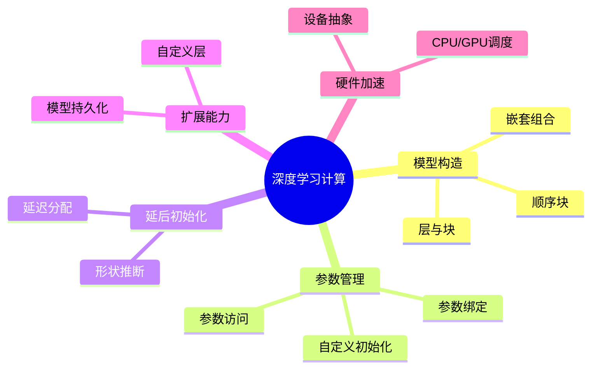

# 深度学习计算

## 脑图

## 背景

深度学习的早期实践以**单个神经元**和**单层网络**为基本单位，研究者逐层手动搭建网络。随着网络架构日趋复杂——从 AlexNet 到 ResNet 再到 Transformer，**手动逐层拼装**的方式已经无法应对工程需求。业界的思维方式发生了根本转变：从关注单个神经元的行为，转向以**层（layer）**和更粗粒度的**块（block）**为基本单元来构思和组织网络。这一章要回答的核心问题是：如何像搭积木一样构建、管理和部署深度学习模型？

## 问题

- **模型如何像积木一样灵活组合与复用？**——复杂网络不应从零手写，需要模块化的构造机制
- **数以百万计的参数如何统一访问、初始化和共享？**——缺乏参数管理机制，模型训练和调试无从谈起
- **定义网络时不知道输入形状怎么办？**——架构定义与数据维度之间的耦合是构建阶段的核心障碍
- **标准层不够用时如何扩展？**——研究前沿往往需要框架不提供的新型计算单元
- **训练好的模型如何保存、恢复和迁移？**——模型的生命周期不应局限于单次训练过程
- **如何突破 CPU 的计算瓶颈？**——大规模模型训练依赖硬件加速

## 解决方案

### 层和块：模块化构造

深度学习框架引入**块（Block）**作为模型构造的基本单元。一个块可以是单个层，也可以是多个层的组合，甚至可以包含其他块——形成**嵌套的层级结构**。这种设计带来三个关键能力：

- **组合**：简单块通过嵌套组合成复杂网络，无需从零实现
- **复用**：同一个块可以在网络的不同位置重复使用
- **灵活性**：块的**前向传播函数**中可以执行任意代码，不仅限于顺序的数学运算

**顺序块（Sequential）** 是最基础的组合方式——按数据流动顺序依次串联各层，自动将前一层的输出作为下一层的输入。更复杂的架构（如残差连接、多分支结构）则通过自定义块的前向传播逻辑来实现。

### 参数管理：统一接口

模型参数是训练的核心对象，框架提供三个层次的参数访问机制：

| 访问层次 | 方式 | 适用场景 |
|---------|------|---------|
| 逐层访问 | 通过索引定位具体层 | 调试单层行为 |
| 全局访问 | 一次性遍历全部参数 | 批量操作（如保存、正则化） |
| 嵌套访问 | 通过层级化命名定位 | 复杂嵌套网络的精确定位 |

**自定义初始化**允许用户突破内置初始化方法的限制，按特定分布规则赋予参数初始值，适配特殊的训练需求。

**参数绑定（Parameter Sharing）** 是一种高效的参数共享手段：将一层的参数直接赋给另一层，使它们不仅值相等，而且**由相同的张量表示**。修改其中一个，另一个自动变化；反向传播时梯度自动合并。这在共享嵌入层、循环网络等场景中既减少参数量，又对同一组权重施加来自不同路径的梯度约束。

### 延后初始化：解耦架构与数据

构建网络时存在一个根本矛盾：定义架构时通常无法确定输入的具体形状，而参数的形状又依赖于输入维度。框架采用**延迟策略**来解决这个问题——不在定义网络时立即分配参数，而是**等到数据第一次通过模型时**，才从第一层开始逐层推断形状，依次确定所有参数尺寸并完成初始化。

这使得**架构定义与输入数据完全解耦**：开发者可以先搭建完整网络，再用真实数据触发初始化，无需手动计算和指定每一层的维度。

### 自定义层与模型持久化

**自定义层**允许用户创建框架不提供的新型计算单元。无论是不带参数的简单变换，还是带可学习参数的复杂操作，自定义层都可以**无缝融入框架的自动微分和参数管理体系**中，行为与内置层完全一致。

**模型持久化**分为两个层次：

| 层次 | 保存内容 | 特点 |
|------|---------|------|
| 张量级 | 单个或多个张量 | 直接序列化原始数据 |
| 参数级 | 网络全部权重 | 需要先重新定义架构，再加载参数 |

一个关键约束是：框架保存的是**参数而非模型本身**。架构代码无法被序列化，恢复模型时必须先用代码重建网络结构，再将参数加载进去。

### GPU 加速：设备抽象

框架将 CPU 和 GPU 抽象为统一的**设备（device）**概念。每个张量关联一个设备标识，用户指定数据在哪个设备上创建和计算，框架负责底层的显存分配和计算调度。

关键原则是**减少设备间的数据移动**：

- 跨设备传输的开销远大于计算本身，是性能的主要瓶颈
- 所有参与同一计算的输入数据必须在同一设备上，否则直接报错
- 不经意的数据移动（如打印 GPU 张量、转换格式）会触发隐式传输，显著降低性能

## 效果

- **模块化构造**将模型构建从"逐层手写"变为"积木拼装"，大幅降低了复杂网络的实现门槛，使 ResNet、Transformer 等架构得以被快速复现和创新
- **延后初始化**消除了架构定义与数据维度之间的耦合，使模型构建流程更加灵活，减少了维度错误这一最常见的开发障碍
- **参数绑定**在减少参数量的同时引入了跨路径的梯度约束，是一种兼具效率和正则化效果的设计模式
- **设备抽象**使 GPU 加速对开发者透明——只需指定设备标识，框架自动处理数据传输和计算调度，将硬件差异封装在统一接口之下

## 核心框架

| 概念 | 作用 | 关键特性 |
|------|------|---------|
| 块（Block） | 模型构造的基本单元 | 可嵌套组合，前向传播支持任意逻辑 |
| 顺序块（Sequential） | 按顺序串联层 | 自动传递数据，简化线性网络构建 |
| 参数访问与绑定 | 管理模型权重 | 三级访问机制，支持跨层共享 |
| 延后初始化 | 解耦架构与数据 | 首次前向传播时推断参数形状 |
| 自定义层 | 扩展框架能力 | 融入自动微分和参数管理体系 |
| 模型持久化 | 保存与恢复模型 | 张量级和参数级两层机制 |
| 设备抽象 | 统一 CPU/GPU 管理 | 透明的硬件加速和数据调度 |
