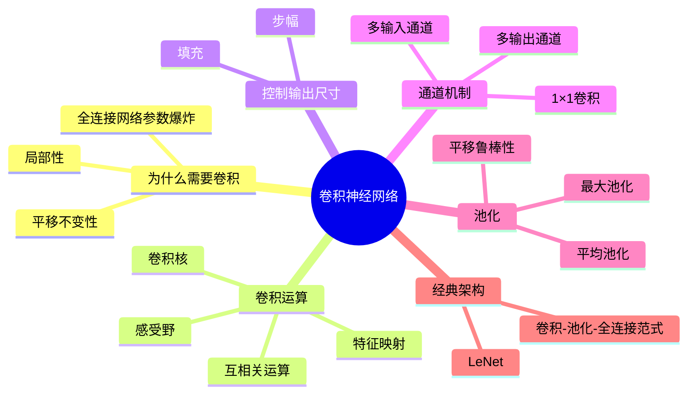

# 卷积神经网络

## 脑图

## 背景

20世纪80年代末，计算机视觉面临一个根本性矛盾：图像数据天然具有**二维空间结构**，但主流的**全连接多层感知机**将图像展平为一维向量处理，完全丢弃了相邻像素之间的空间关联。一张百万像素的图像输入全连接层会产生数十亿参数，既不可训练也无法泛化。1989年，Yann LeCun在AT&T贝尔实验室提出**LeNet**，首次证明**卷积神经网络**可以通过反向传播成功训练，在手写数字识别上取得了与支持向量机匹敌的性能，并被实际部署于自动取款机中识别支票数字。这奠定了现代计算机视觉的基础范式。

## 问题

- **全连接网络处理图像为何参数量爆炸？** —— 每个输入像素连接每个隐藏单元，忽略了图像的空间结构
- **同一物体出现在图像不同位置时，网络如何保持识别能力？** —— 需要满足**平移不变性**约束
- **如何让网络只关注局部区域而非整张图像？** —— 需要满足**局部性**约束，减少参数并保留空间信息
- **多层卷积后输出尺寸不断缩小、边界信息丢失怎么办？** —— 需要**填充**和**步幅**机制控制输出维度
- **如何在降低分辨率的同时保持特征的鲁棒性？** —— 需要**池化**层对局部信息进行聚合

## 解决方案

### 从全连接到卷积：以归纳偏置换取参数效率

全连接网络的根本问题在于它对图像没有任何先验假设——每个像素都可能与任何其他像素相关。CNN的突破在于引入两个**归纳偏置**：

**平移不变性**：无论目标物体出现在图像的哪个位置，网络应产生类似的响应。这意味着所有空间位置共享同一组参数（**参数共享**），从数十亿参数降至几百个参数。

**局部性**：每个隐藏神经元只需关注输入中以目标位置为中心的有限邻域（**局部连接**），而非整张图像。这进一步大幅削减参数量。

这两个约束是CNN高效的根本原因。当数据确实满足这些假设时，模型高效且泛化良好；反之则可能难以拟合。

### 卷积运算：滑动窗口特征提取

CNN的核心操作是**互相关运算**（实践中称为卷积）：一个小尺寸的**卷积核**在输入上滑动，在每个位置计算局部区域与核的加权求和。

- **卷积核**是可训练的权重参数，通过学习自动发现边缘、纹理等特征检测器
- **感受野**指影响某层某个元素计算的所有前层元素集合，通过叠加卷积层可以逐步扩大感受野，捕获更全局的特征
- 卷积层的输出称为**特征映射**（feature map），将输入映射到下一层的空间维度

### 填充与步幅：精确控制输出尺寸

**填充**（Padding）：在输入边界补零，防止多层卷积导致输出尺寸持续缩小。常见做法是设置填充使输入输出尺寸相同（"same"填充）。

**步幅**（Stride）：卷积核每次滑动的间距。步幅大于1时跳过中间位置，同时起到降低采样和减少计算量的作用。

两者配合可以精确调控输出特征图的空间维度。实践中卷积核通常选奇数尺寸（3、5、7），便于对称填充。

### 多通道机制：从空间到语义的扩展

**多输入通道**：处理彩色图像等多通道输入，卷积核对每个通道分别执行互相关后求和，实现跨通道信息整合。

**多输出通道**：每层使用多个独立的卷积核，产生多个输出通道，每个通道学习不同的特征检测器。通道数越多，特征表示越丰富。实践中网络越深通道数越多、空间分辨率越小——用通道深度换取更丰富的语义表示。

**1×1卷积**：在空间维度上无意义（窗口最小），其唯一计算发生在通道维度上。等价于在每个像素位置独立应用一个**全连接层**，主要用于调整通道数量和控制模型复杂度。

### 池化：下采样与平移鲁棒性

**池化层**对局部区域进行下采样，有两个核心目标：

1. **聚合信息、降低分辨率**：生成越来越粗糙的特征映射，逐步扩大感受野
2. **增强平移鲁棒性**：即使输入微小平移，只要特征仍在池化窗口内，输出不变

**最大池化**取窗口内最大值，捕捉最显著特征；**平均池化**取窗口内均值，平滑局部信息。池化层无参数、通道独立处理。

### LeNet：确立CNN基本范式

LeNet由交替的**卷积层**和**池化层**后接**全连接层**构成，确立了三段式架构：

1. **卷积编码器**：逐层提取特征，空间分辨率逐步缩小，通道数逐步增加
2. **展平**：将多维特征图转为一维向量
3. **全连接密集块**：负责最终分类

这一范式为后续AlexNet、VGG、ResNet等现代网络奠定了基础。

## 效果

CNN通过**局部连接、参数共享、空间下采样**三大机制，以远少于全连接网络的参数量高效捕捉图像的空间层次特征。从LeNet的手写数字识别到现代深度网络的万物识别，CNN的核心设计思想始终未变：用**归纳偏置**（平移不变性+局部性）换取**参数效率**，用**逐层抽象**（低层边缘→中层纹理→高层语义）实现从像素到概念的映射。这一范式统治了计算机视觉领域三十余年，直到Vision Transformer的出现才开始被重新审视。

## 核心框架

| 概念 | 作用 | 关键特性 |
|------|------|----------|
| **卷积核** | 提取局部特征 | 可训练参数，尺寸小（3×3、5×5），所有位置共享 |
| **感受野** | 定义输出神经元的输入范围 | 可通过叠加卷积层逐步扩大 |
| **填充** | 控制输出尺寸，防止边界信息丢失 | 常用"same"填充保持尺寸不变 |
| **步幅** | 控制卷积核滑动间距 | 大于1时降低采样、减少计算量 |
| **多输出通道** | 学习多种特征检测器 | 通道数越多，特征表示越丰富 |
| **1×1卷积** | 跨通道信息融合 | 等价于逐像素全连接，调整通道数 |
| **池化层** | 下采样与平移鲁棒性 | 无参数，通道独立，最大/平均两种策略 |
| **LeNet** | CNN基本范式的确立 | 卷积-池化-全连接三段式架构 |
