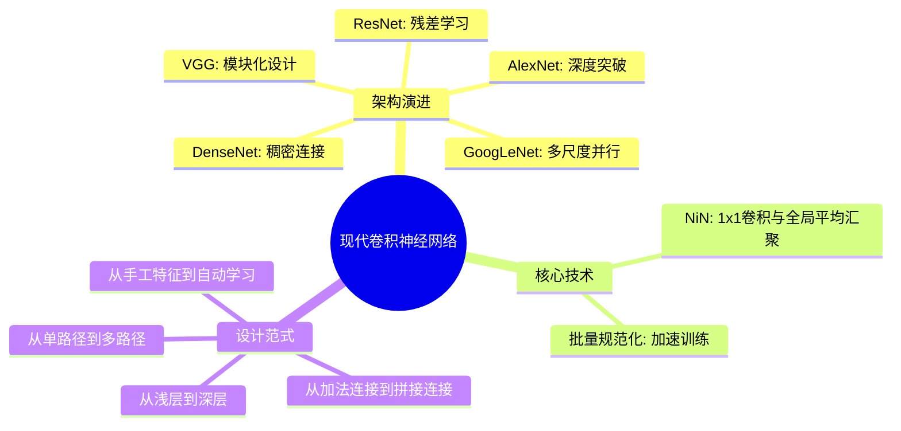

# 现代卷积神经网络

## 脑图

## 背景

2012年之前，计算机视觉长期依赖**手工设计特征**（如SIFT、HOG），再送入分类器。神经网络受制于**数据匮乏**、**算力不足**和**训练技巧缺失**三大瓶颈。AlexNet在ImageNet上的胜利标志着一个转折点：**学习到的特征首次超越了手工特征**。此后，研究者面临的共同命题变成——如何设计更深、更高效的网络架构。从AlexNet到DenseNet的演进，本质上是一场关于**深度**、**宽度**和**信息流**的持续探索。

## 问题

- **如何突破浅层网络的性能天花板？** 简单堆叠层并不能保证更深的网络优于较浅的网络。
- **如何建立可复用的网络设计范式？** 每个网络从零设计，缺乏统一的构建模块。
- **不同尺度的特征如何同时被捕捉？** 单一卷积核尺寸难以兼顾细粒度和全局信息。
- **深层网络的训练为何不稳定？** 中间层分布漂移导致收敛困难。
- **跨层信息如何高效传递？** 深层网络中梯度消失使底层参数难以更新。

## 解决方案

### 突破深度瓶颈：AlexNet

AlexNet的贡献不在于精巧的架构，而在于**证明了可行性**。它用8层网络、**ReLU激活函数**（替代sigmoid，解决梯度消失）、**Dropout正则化**和**GPU并行加速**，在ImageNet上以显著优势夺冠。核心洞见：**数据和算力是深度学习突破的两大缺失成分**，ImageNet数据集与GPU硬件共同促成了这一转折。

### 模块化设计：VGG

VGG提出了**块（block）** 的设计范式。每个VGG块由多个3x3卷积层加一个最大汇聚层组成，不同模型通过调整块的数量和每块的卷积层数来定义。关键发现：**深层窄卷积（3x3）优于浅层宽卷积**。这一抽象层次的提升，使网络定义从逐层编写变为模块化组装，类似芯片设计中从晶体管到逻辑块的演进。

### 消除全连接层：NiN

传统CNN在卷积特征之后堆叠全连接层，会**放弃空间结构**且参数量巨大。NiN用两个**1x1卷积层**替代全连接层做逐像素非线性变换，最后用**全局平均汇聚层**生成输出。这一设计大幅减少参数、降低过拟合，其理念深刻影响了GoogLeNet等后续架构。

### 多尺度并行：GoogLeNet

单一卷积核尺寸无法同时捕捉不同尺度的特征。GoogLeNet的**Inception块**用四条并行路径（1x1、3x3、5x5卷积和最大汇聚）同时提取不同尺度的信息，再通过1x1卷积**降维控制计算量**。核心启示：**不必在大卷积核和小卷积核之间二选一——并行组合不同尺度的操作是更优雅的方案**。

### 训练稳定性：批量规范化

深层网络训练中，各层输入分布不断变化（**内部协变量偏移**），导致收敛困难。**批量规范化**在每层对小批量数据做标准化，再通过可学习参数恢复表达能力。效果：**显著加速收敛**，允许使用更大学习率，并带来隐式正则化。BN与残差块的结合，使训练百层以上网络成为可能。

### 残差学习：ResNet

理论上更深的网络不应更差，但实践中深层网络的训练误差反而更高。问题出在**函数类的非嵌套性**。ResNet的**残差块**让网络学习 f(x) - x 而非直接学习 f(x)，通过**跨层恒等连接**将输入加回。如果理想映射接近恒等映射，只需将残差权重置零即可——比学习完整恒等映射容易得多。这一设计使152层网络的训练成为现实。

### 稠密连接：DenseNet

ResNet用**加法**连接跨层信息，本质上将函数分解为线性项和非线性项两部分。DenseNet追问：能否扩展为更多部分？它用**拼接**替代加法，每层的输入是前面**所有层输出在通道维度的连接**，实现**特征复用**。通过**过渡层**（1x1卷积压缩通道 + 平均汇聚降维）控制复杂度。DenseNet以更少的参数实现了与ResNet相当的性能。

### 架构演进对比

| 网络 | 核心创新 | 跨层连接方式 | 关键贡献 |
|------|----------|-------------|----------|
| AlexNet | 深度 + ReLU + Dropout | 无 | 证明深度网络可行 |
| VGG | 3x3小卷积核 + 块结构 | 无 | 模块化设计范式 |
| NiN | 1x1卷积 + 全局平均汇聚 | 无 | 消除全连接层 |
| GoogLeNet | Inception多尺度并行 | 无 | 并行多路径结构 |
| ResNet | 残差学习 | 加法 | 使极深网络可训练 |
| DenseNet | 稠密连接 | 拼接 | 特征复用与参数效率 |

## 效果

这一系列架构创新带来了三个本质改变：

**从手工到自动**。AlexNet证明了神经网络可以自动学习比人工设计更好的特征，彻底改变了计算机视觉的研究范式。

**深度成为可能**。从AlexNet的8层到ResNet的152层，残差连接和批量规范化共同解决了深层网络的训练难题。**深度不再受限于优化困难，而只受限于计算预算和过拟合风险**。

**设计从经验走向原则**。VGG的块结构、GoogLeNet的并行路径、ResNet的残差学习，每一项创新都提炼出了可迁移的设计原则。这些原则不仅适用于卷积网络，更深刻影响了后续Transformer等架构的设计——残差连接、层归一化、多头注意力中的并行路径，都能在本章找到思想源头。

## 核心框架

| 概念 | 作用 | 关键特性 |
|------|------|----------|
| 卷积块/层 | 局部特征提取 | 权重共享、平移不变性 |
| 1x1卷积 | 通道变换与降维 | 跨通道信息整合，不改变空间尺寸 |
| 残差连接 | 跨层信息传递 | 恒等映射捷径，梯度直通 |
| 稠密连接 | 特征复用 | 所有前层输出拼接，信息最大化流动 |
| Inception块 | 多尺度特征提取 | 并行路径 + 通道拼接 |
| 批量规范化 | 训练稳定化 | 层间标准化 + 可学习仿射变换 |
| 全局平均汇聚 | 替代全连接层 | 参数量骤降，保留空间信息 |
| Dropout | 正则化 | 随机失活神经元，防止过拟合 |
