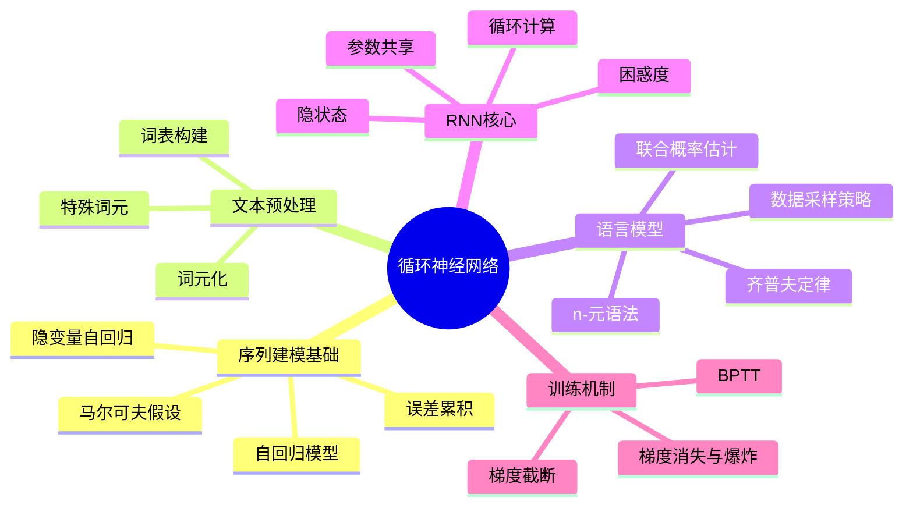

# 循环神经网络

## 脑图

## 背景

现实世界中大量数据具有**序列结构**——文本、语音、股票价格、视频帧，数据点之间存在时间依赖关系，顺序不可打乱。传统深度学习模型（如CNN和MLP）假设数据**独立同分布**，无法捕捉这种时序关联。与此同时，n元语法等统计方法面临**参数量随上下文长度指数增长**的困境。在这一背景下，**循环神经网络（RNN）**被提出，其核心动机是：用一个固定大小的**隐状态**来压缩整个序列历史，从而以恒定参数量建模任意长度的时序依赖。

## 问题

- **序列数据的时间依赖**如何被统计模型捕捉？预测下一步需要多少历史信息？
- **文本如何转化为**模型可处理的数值表示？词元化粒度和词表设计如何影响建模？
- **语言模型**如何估计序列概率？n-元语法为何失效，深度学习如何替代？
- **前馈网络为何无法**处理序列？RNN通过什么机制引入"记忆"？
- **RNN的梯度为何**在长序列上不稳定？如何在训练中应对梯度消失与爆炸？

## 解决方案

### 序列建模的两种策略

面对"输入数据量随时间步增长"的计算困境，两种策略提供了出路：

**自回归模型**只取过去固定长度的观测值作为输入，参数数量恒定——本质是"对自己执行回归"。**隐变量自回归模型**则保留一个对过去的"总结"（隐状态），同时更新预测和总结。两种策略都依赖一个关键假设：虽然具体数值会变化，但序列本身的**动力学不变**（平稳性）。

一个重要的实验发现是：**单步预测效果很好，多步预测迅速退化**。误差随预测步数呈几何级增长，这解释了为什么24小时天气预报准确，更远则精度骤降。

### 文本预处理流水线

原始文本到模型输入需要四步转换：加载文本 → **词元化**（拆分为基本单元）→ 构建**词表**（词元到索引的映射）→ 索引化。

词元化存在**粒度选择**问题：单词级词表大但序列短，字符级词表小但序列长。词表构建遵循频率原则，低频词被过滤，未知词元映射为 `<unk>`。特殊词元（`<pad>`、`<bos>`、`<eos>`）为变长序列处理和边界控制提供支撑。

### 从n-元语法到深度语言模型

语言模型的目标是估计序列的联合概率。**n-元语法**通过马尔可夫假设截断依赖关系，但面临**齐普夫定律**揭示的困境：词频呈长尾分布，大量n-元组极少出现，拉普拉斯平滑无法挽救稀疏性。

**齐普夫定律**的关键洞见在于：二元和三元语法也遵循同样的幂律分布，但指数更小——说明语言中存在大量结构，但传统统计方法无法有效利用。这正是深度学习方法的切入点。

长序列训练需要专门的数据采样策略：**随机采样**保证随机性但牺牲覆盖性，**顺序分区**保留相邻子序列的时序关系。两者都从随机偏移量开始，兼顾覆盖性与随机性。

### RNN的核心机制

RNN用**隐状态**解决n-元语法的参数爆炸问题。隐状态通过当前输入和前一时间步的隐状态递归计算，捕获序列直到当前时刻的历史信息。

三个关键设计原则：

1. **参数共享**：不同时间步使用相同参数，参数开销不随时间步增长
2. **隐藏层与隐状态分离**：前者是前向路径上的层，后者是跨时间步传递的信息载体
3. **递推结构**：当前输出由隐状态决定，而隐状态编码了之前所有输入的信息

**困惑度（Perplexity）**作为评估指标，本质是交叉熵损失的指数。最佳值为1（完美预测），基线等于词表大小——它衡量的是"下一个词元的实际选择数的调和平均数"。

### BPTT与梯度问题

RNN的训练依赖**通过时间反向传播（BPTT）**：将RNN在时间上展开为深层前馈网络，然后应用标准反向传播。

核心困难在于梯度计算涉及权重矩阵的高次幂。矩阵特征值中小于1的成分导致**梯度消失**，大于1的导致**梯度爆炸**。实践中有三种截断策略：

| 策略 | 做法 | 特点 |
|------|------|------|
| 完全计算 | 展开所有时间步 | 理论精确，实际不可用（蝴蝶效应式数值不稳定） |
| 常规截断 | 固定时间步后截断梯度链 | 实践最常用，侧重短期影响 |
| 随机截断 | 用随机变量替换部分梯度项 | 理论优雅但方差大，不优于常规截断 |

**梯度截断**不仅是为了计算便利，更是数值稳定的需要——它提供了有益的正则化效果。这一认识直接催生了后续章节中**LSTM**和**GRU**等从结构层面缓解长程依赖问题的架构。

## 效果

RNN的引入带来了本质性的改变：

- **序列建模从不可能变为可能**。隐状态机制以恒定参数量建模任意长度序列，打破了n-元语法的参数指数爆炸困境
- **语言模型从统计计数转向端到端学习**。字符级RNN语言模型可在没有任何语言学先验的情况下学习文本结构，证明了深度学习对序列数据的有效性
- **暴露了深度序列模型的根本矛盾**。BPTT揭示的梯度消失与爆炸问题，不是实现层面的bug，而是循环结构的固有局限——这一认识直接推动了LSTM、GRU、Transformer等一系列架构创新
- **多步预测的误差累积**被量化理解：误差呈几何级增长，模型能力随预测跨度急剧下降，这一规律适用于所有自回归序列模型

## 核心框架

| 概念 | 作用 | 关键特性 |
|------|------|----------|
| 自回归模型 | 用固定长度历史预测未来 | 参数量恒定，依赖马尔可夫假设 |
| 隐变量自回归 | 用隐状态压缩序列历史 | 状态递推更新，信息有损压缩 |
| 词元化 | 文本→基本单元 | 粒度选择影响词表大小和序列长度 |
| 词表 | 词元→数字索引的映射 | 基于频率构建，低频词过滤 |
| n-元语法 | 统计语言建模 | 参数量随阶数指数增长，受稀疏性制约 |
| 隐状态 | 存储序列历史信息 | 跨时间步传递，参数共享 |
| 困惑度 | 语言模型评估 | 交叉熵的指数，最佳为1 |
| BPTT | RNN训练的梯度计算 | 展开计算图，梯度截断保障稳定 |
| 梯度截断 | 缓解梯度不稳定 | 固定步长截断最常用，兼具正则化效果 |
