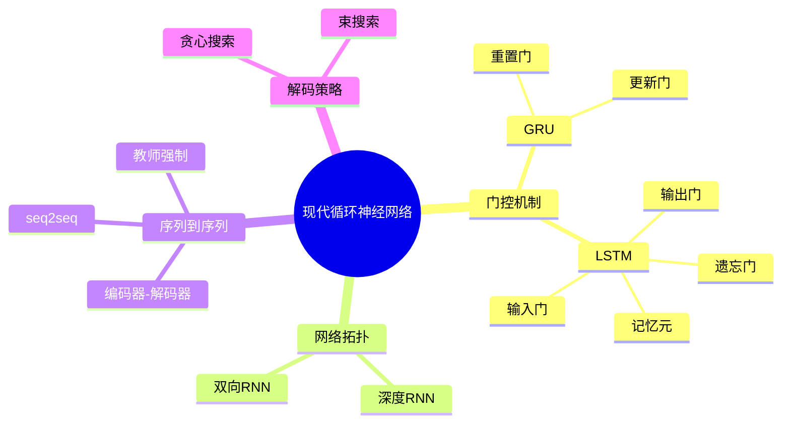
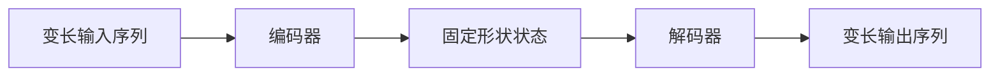

# 现代循环神经网络

## 脑图

## 背景

基础RNN在实践中面临**数值不稳定性**——梯度在长序列上指数级衰减或爆炸，导致模型无法捕捉**长距离依赖**。与此同时，现实世界中的序列任务远不止语言建模：**机器翻译**、**语音识别**等任务要求将一个可变长度的序列映射为另一个可变长度的序列，这是基础RNN从未考虑过的范式。这两股力量——内部的梯度问题和外部的任务需求——共同推动了现代循环神经网络的诞生。

## 问题

- **梯度消失/爆炸**：基础RNN无法在长序列上有效传播梯度，导致长期依赖学习失败
- **信息流缺乏控制**：模型无法自主决定"记住什么、遗忘什么、输出什么"
- **单层表示能力有限**：单层RNN难以捕捉序列中的多层级抽象模式
- **只能单向利用上下文**：无法同时利用过去和未来的上下文信息
- **变长到变长的映射**：输入输出长度不同时，如何建立序列间的转换框架

## 解决方案

### 门控机制：从"全开"到"可控"

基础RNN的隐状态更新是无差别的——每个时间步都以相同方式混合旧状态和新输入。现代RNN的核心突破是引入**门（gate）**：一个输出值在0到1之间的信号，逐元素地控制信息的通过量。

**GRU** 用两个门实现简洁而有效的控制：

- **重置门**：控制"从过去保留多少信息"来构建候选状态，负责**短期依赖**
- **更新门**：控制"旧状态和新状态各占多少比例"，负责**长期依赖**

更新门接近1时，信息像在时间轴上搭了**捷径**——旧状态几乎原封不动地传递下去，梯度可以沿着这条路径不衰减地流动。这与残差连接的思想一脉相承。

**LSTM** 在GRU之前近20年提出，走了一条更精细的路线：引入独立的**记忆元**作为长期记忆的载体，用三个门分别控制读入（**输入门**）、清除（**遗忘门**）和输出（**输出门**）。

| 维度 | GRU | LSTM |
|------|-----|------|
| 门的数量 | 2（重置、更新） | 3（输入、遗忘、输出） |
| 状态数量 | 1（隐状态） | 2（隐状态 + 记忆元） |
| 复杂度 | 较低，训练更快 | 较高，表达能力更强 |
| 核心思想 | 隐状态本身承担记忆功能 | 记忆元专职长期记忆，隐状态专职输出 |

当遗忘门为1、输入门为0时，LSTM的记忆元会无损地传递历史信息——这是一条**信息高速公路**，梯度沿着它可以在任意长的距离上有效传播。

### 网络拓扑：深度与双向

**深度RNN** 将多个RNN层堆叠：底层处理低级特征，高层组合出抽象表示，各层隐状态独立演化。这与CNN通过堆叠层逐步提取高层特征的思想一致。

**双向RNN** 同时从前往后和从后往前处理序列，拼接两个方向的隐状态。这在**命名实体识别**等需要完整上下文的标注任务中非常有效。但有一个关键限制：**双向模型不能用于逐步预测未来的任务**（如语言建模），因为它会"偷看"尚未出现的未来信息。

### 编码器-解码器：序列到序列的通用框架

面对"输入输出长度不同"这一根本挑战，**编码器-解码器架构**提供了一个优雅的抽象：

编码器将任意长度的输入压缩为**固定形状的上下文向量**，解码器从这个向量出发逐步生成输出序列。这个框架定义了"做什么"，而具体"用什么网络来做"可以灵活选择。

**seq2seq** 是该架构用RNN实现的具体实例。训练时采用**教师强制**——将真实标签（而非模型预测）作为解码器每一步的输入，这对收敛至关重要。推理时则切换为**自回归生成**：每步用模型自身的预测作为下一步输入，直到生成结束词元。

### 解码策略：在最优与可行之间

推理时如何选择输出序列？三种策略形成了一个谱系：

| 策略 | 思想 | 优势 | 代价 |
|------|------|------|------|
| **贪心搜索** | 每步选概率最高的词元 | 最快 | 局部最优，质量差 |
| **穷举搜索** | 遍历所有可能序列 | 全局最优 | 计算量指数级爆炸 |
| **束搜索** | 每步保留k个最优候选 | 质量与速度的折中 | k越大越接近穷举 |

**束搜索** 是实际应用中的标准做法。束宽k是核心超参数：k越大探索越广但计算量线性增长，k=1时退化为贪心搜索。通过长度惩罚因子可以避免偏好过短的序列。

## 效果

这些方案的本质贡献在于三个层面：

**梯度层面**——门控机制（GRU/LSTM）通过类似残差连接的信息捷径，从根本上缓解了**梯度消失**，使模型能够跨越数百个时间步学习依赖关系。这是从"无法训练"到"可以训练"的质变。

**架构层面**——深度堆叠提升了序列建模的表达能力；双向处理打破了时间方向的限制；编码器-解码器框架将序列模型从"序列到标签"扩展为"序列到序列"，打开了机器翻译等全新任务域。

**解码层面**——束搜索在贪心（质量差）和穷举（不可能）之间找到了实用的平衡点，使序列生成从理论变为现实。

然而，这些方案并未根本解决**长序列中的信息瓶颈**问题——编码器-解码器将整个输入压缩为固定长度向量，信息丢失不可避免。这一局限后来催生了**注意力机制**（下一章），它允许解码器在每一步直接访问编码器的所有时间步，从根本上消除了信息瓶颈。
