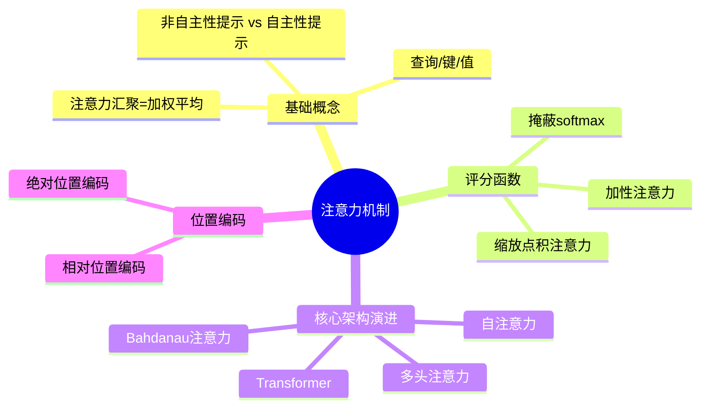
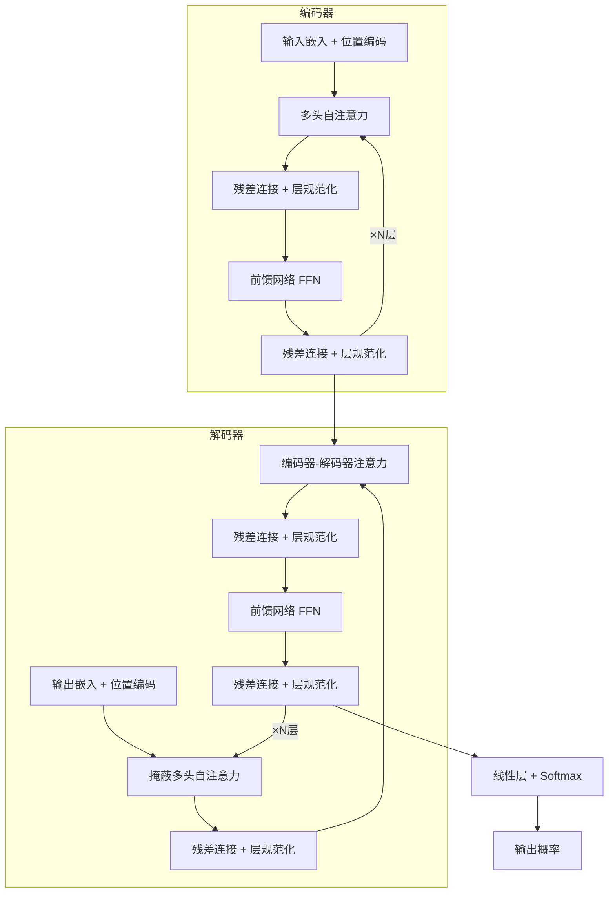

# 注意力机制

## 脑图

## 背景

深度学习早期，**RNN** 和 **CNN** 是序列建模的两大支柱，但各自存在根本缺陷。RNN 将整个输入序列压缩为一个**固定形状的上下文变量**，形成**信息瓶颈**——长序列中早期信息容易丢失，且逐步顺序计算无法并行化。CNN 虽可并行，但受限于**感受野大小**，捕捉长距离依赖需要堆叠大量层。

2014年，Bahdanau 等人在机器翻译任务中发现：解码器在生成不同词元时，应该关注输入序列的**不同位置**。这一观察催生了**注意力机制**——一种让模型动态选择性聚合信息的方法，从根本上突破了固定上下文的瓶颈。

此后，注意力机制从"辅助模块"演变为"核心架构"。2017年 **Transformer** 的出现证明：**仅靠注意力机制就能构建强大的序列模型**，无需任何卷积或循环层。这一架构随后被推广到语言、视觉、语音和强化学习等广泛领域，成为现代深度学习的基础。

## 问题

- 如何让模型在大量输入中**聚焦**于与当前任务最相关的部分？
- 如何打破固定上下文变量造成的**信息瓶颈**？
- 如何高效衡量查询与键之间的**相关程度**？
- 如何让模型同时捕捉**短距离和长距离依赖**？
- 如何在完全放弃循环结构后保留**序列顺序信息**？

## 解决方案

### 从人类注意力到计算模型

人类注意力分为**非自主性提示**（由外界刺激自动吸引）和**自主性提示**（由主观意愿驱动）。注意力机制的核心贡献是将**自主性提示**引入神经网络：用**查询**表示任务需求，用**键**表示输入标签，用**值**表示实际内容。查询与键的匹配程度决定对值的选择偏向，输出为**加权平均**。

这一框架将注意力从人类认知现象转化为可计算的数学模型，是后续所有变体的统一基础。

### 评分函数：衡量相关性

注意力汇聚的输出是值的加权和，**评分函数**决定权重分配。两种核心评分函数适用于不同场景：

| 评分函数 | 适用场景 | 核心思想 |
|---------|---------|---------|
| **加性注意力** | 查询和键长度不同 | 将查询和键经线性变换后相加，通过 MLP 映射为标量 |
| **缩放点积注意力** | 查询和键长度相同 | 点积计算相关性，除以 √d 保持方差稳定 |

**掩蔽softmax** 是处理变长序列的关键技术：通过指定有效序列长度，过滤掉填充位置，确保注意力不浪费在无意义的词元上。

### Bahdanau 注意力：动态上下文

经典 seq2seq 中，解码器每个时间步使用**同一个**上下文变量。Bahdanau 注意力的关键突破是：**让每个解码步骤拥有自己独立的上下文变量**。

- **查询**：上一时间步的解码器隐状态
- **键和值**：编码器在所有时间步的隐状态
- **上下文变量**：注意力汇聚的输出，即对编码器隐状态的加权求和

这是一种**可微的对齐机制**，模型能自动学会源语言和目标语言之间的软对齐关系。

### 多头注意力：多视角观察

单一注意力机制只能学习一种注意力模式。**多头注意力**用 h 组独立学习的线性投影分别变换查询、键、值，将它们送入并行的注意力汇聚中。

每个头关注输入的不同方面，利用查询、键和值的**不同子空间表示**。多头注意力能够融合来自多个注意力汇聚的不同知识，表示比简单加权平均更复杂的函数。

### 自注意力：全局交互

自注意力的关键在于**查询、键和值来自同一组输入**。每个词元通过注意力机制同时与序列中所有其他词元交互。

三种序列建模架构的本质对比：

| 架构 | 并行度 | 最大路径长度 | 长距离依赖 |
|------|--------|------------|-----------|
| **CNN** | 高 | O(n/k) | 需多层堆叠 |
| **RNN** | 低（顺序计算） | O(n) | 学习困难 |
| **自注意力** | 高 | O(1) | 直接连接 |

自注意力的代价是计算复杂度为序列长度的二次方。

### 位置编码：注入顺序信息

自注意力本身是**置换等变**的，不感知顺序。**位置编码**通过将位置信息与输入嵌入相加来补偿这一缺陷。

正弦/余弦位置编码的设计精妙之处：不同维度使用不同频率的三角函数，类似二进制编码中高位交替慢、低位交替快。对任意固定偏移 δ，位置 i+δ 的编码可通过位置 i 的编码**线性投影**得到，投影矩阵**不依赖于位置索引**，使模型能自然学习相对位置关系。

### Transformer：纯注意力架构

Transformer 的根本突破在于**完全基于注意力机制**，没有任何卷积层或循环层。

**编码器**：每层包含多头自注意力和前馈网络两个子层，查询、键和值都来自前一层的输出。

**解码器**比编码器多一个子层——**编码器-解码器注意力**，查询来自解码器，键和值来自编码器输出。解码器的自注意力使用**掩蔽**机制：任何查询只会与已生成词元的位置进行注意力计算，保留**自回归属性**。

**残差连接 + 层规范化**环绕每个子层。层规范化基于特征维度（而非样本维度），对变长输入更鲁棒。

**前馈网络**是同一 MLP 对所有位置独立应用，充当逐位置的特征变换器。

## 效果

注意力机制带来的本质改变是**信息聚合方式的革命**：从固定压缩变为动态选择，从局部感知变为全局交互，从顺序处理变为并行计算。

**信息瓶颈的消除**：Bahdanau 注意力证明，让模型在每个生成步骤动态选择关注的输入位置，翻译质量显著提升。可视化注意力权重可以清楚看到不同解码步骤关注输入序列的不同位置。

**长距离依赖的解决**：自注意力的最大路径长度为 O(1)，任意两个位置直接连接，彻底解决了 RNN 中长距离信息传递困难的问题。

**计算效率的提升**：Transformer 的并行计算能力远超 RNN，且通过多头机制在同一层内同时捕捉多种依赖关系。

**架构的统一性**：Transformer 已被推广到语言、视觉、语音和强化学习等领域，成为现代深度学习的基础架构。其核心设计思想——自注意力、位置编码、残差连接、层规范化——已成为构建深度模型的标准组件。

## 核心框架

| 概念 | 作用 | 关键特性 |
|------|------|---------|
| **查询/键/值** | 注意力机制的三要素 | 查询驱动选择，键匹配相关性，值承载内容 |
| **评分函数** | 衡量查询与键的相关程度 | 加性注意力用于异长序列，缩放点积注意力用于等长序列 |
| **Bahdanau注意力** | 解决信息瓶颈 | 每个解码步动态聚合输入信息，可微对齐 |
| **多头注意力** | 多视角并行观察 | h 个独立子空间，融合多种注意力模式 |
| **自注意力** | 全局交互 | 查询、键、值同源，O(1) 路径长度 |
| **位置编码** | 注入序列顺序 | 正弦编码支持相对位置学习 |
| **Transformer** | 纯注意力架构 | 编码器-解码器、掩蔽自注意力、残差+层规范化 |
