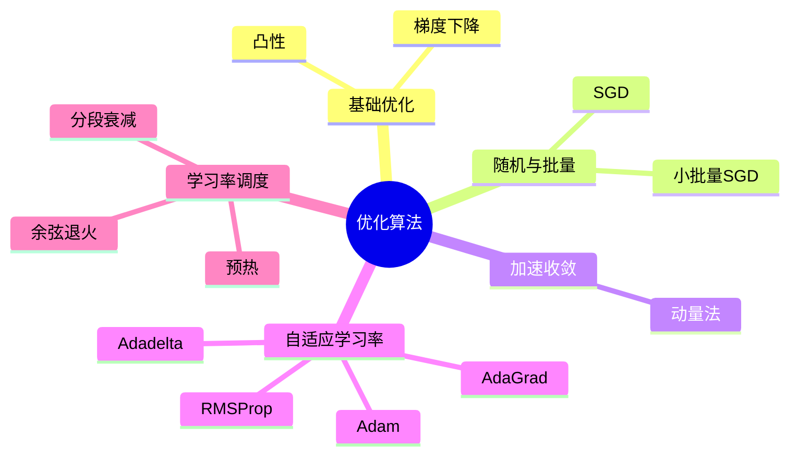

# 优化算法

## 脑图

## 背景

深度学习的核心任务是训练模型，而训练的本质就是**优化**——通过迭代调整模型参数来最小化损失函数。从最早的**梯度下降**到今天的 **Adam**，优化算法的发展史就是一部不断解决"如何更快、更稳、更省地训练深度模型"的历史。早期深度网络训练困难重重：**梯度消失**让网络无法有效学习，**鞍点**让优化停滞不前，**病态条件**让收敛缓慢。这些挑战驱动了一系列优化算法的诞生，从引入随机性到自适应调整学习率，最终使训练大规模深度模型成为可能。

## 问题

- 深度学习的损失函数**非凸**，如何避免陷入**局部最小值**和**鞍点**？
- 全梯度计算代价过高，如何在**计算效率**与**梯度估计质量**之间取得平衡？
- 不同参数的梯度量级差异大，**统一学习率**无法适应所有参数，怎么办？
- 在**狭长峡谷**形损失面上，SGD 严重震荡、收敛缓慢，如何加速？
- **固定学习率**无法兼顾训练初期的快速探索和后期的精细收敛，如何动态调整？

## 解决方案

### 从全量到随机：降低计算代价

**梯度下降**沿梯度反方向迭代更新参数，是所有优化算法的起点。但全梯度下降需要遍历所有样本才能计算一次梯度，代价高昂。

**随机梯度下降（SGD）** 用单个样本的梯度近似全梯度，大幅降低计算成本。噪声梯度虽然每步不精确，但长期来看方向正确，且噪声本身有助于逃离不良临界点。**小批量SGD** 进一步折中——每次采样一个 mini-batch，兼顾向量化计算效率与梯度估计质量。批量大小成为关键超参数：过小则噪声大，过大则内存负担重且可能泛化差。

### 动量法：抑制震荡、加速收敛

当损失面呈狭长峡谷形时，SGD 沿陡峭方向震荡、沿平坦方向缓慢。**动量法**引入物理直觉——维护一个**速度变量**，将历史梯度的**指数加权移动平均**累加到当前更新中。效果是：在一致方向上累积力量加速，在振荡方向上因正负抵消而减速。动量法本质上是对过去梯度的平滑，使优化轨迹更加稳定。

### 自适应学习率：因参数而异

不同参数需要不同的更新步长。**AdaGrad** 为每个参数累积历史梯度平方，自动降低频繁更新参数的学习率，保持稀有特征的较大学习率。但累积只增不减导致学习率过早衰减、训练停滞。

**RMSProp** 用**指数加权移动平均**替代简单累积，引入"遗忘"机制，解决了 AdaGrad 学习率单调递减的问题。**Adadelta** 更进一步，用参数更新量的移动平均代替全局学习率，完全消除了学习率超参数。

### Adam：集大成者

**Adam** 结合动量法（一阶矩估计）和 RMSProp（二阶矩估计）的优势，同时追踪梯度的均值和方差，并通过**偏差修正**解决冷启动时估计偏向零的问题。它兼具动量的加速效果和自适应学习率的便利性，是目前最广泛使用的默认优化器。

| 算法 | 核心思想 | 解决的关键问题 |
|------|---------|--------------|
| SGD | 单样本梯度近似 | 全梯度计算代价高 |
| 动量法 | 梯度的指数加权移动平均 | 狭长峡谷中的震荡 |
| AdaGrad | 累积梯度平方自适应缩放 | 统一学习率不适合所有参数 |
| RMSProp | 指数衰减替代累积 | AdaGrad 学习率过早衰减 |
| Adam | 动量 + RMSProp + 偏差修正 | 综合以上所有优势 |

### 学习率调度：匹配训练阶段

训练不同阶段对学习率的需求不同：初期需要大步探索，后期需要小步精调。**学习率调度器**在训练过程中动态调整学习率。

关键策略包括：**预热（Warmup）** 在训练初期从较小学习率线性增长，防止随机初始化时的大步导致发散；**余弦退火** 按余弦曲线平滑衰减，前期缓后期急，适合精细收敛；**分段常数衰减** 在进展停滞时降低学习率，让优化进入新的搜索阶段。

学习率调度不仅影响收敛速度，还影响模型的**泛化能力**——不同的调度策略会导致不同的过拟合程度。

## 效果

优化算法的演进带来了三个本质改变：

**训练可行性**：从无法训练深层网络到大规模模型训练成为常态。SGD 的随机性、Adam 的自适应性和学习率调度的配合，使训练数百层的网络变得可行。

**超参数简化**：从需要精细调节学习率、动量等多个超参数，到 Adam 等算法对超参数相对不敏感，降低了调参门槛。Adadelta 甚至消除了学习率超参数。

**收敛质量**：优化算法不仅决定收敛速度，还影响最终模型的**泛化性能**。小批量的噪声、学习率调度策略的选择，都会影响模型在测试集上的表现。优化不再只是"让损失下降"，而是深度学习系统设计的核心组成部分。

## 核心框架

| 概念 | 作用 | 关键特性 |
|------|------|---------|
| 梯度下降 | 所有优化算法的基础 | 沿梯度反方向更新，需选择学习率 |
| SGD | 引入随机性降低计算代价 | 噪声梯度，有助于逃离鞍点 |
| 小批量SGD | 计算效率与梯度质量的折中 | 向量化执行，批量大小是关键超参数 |
| 动量法 | 抑制震荡、加速一致方向收敛 | 速度变量累积历史梯度，指数加权移动平均 |
| AdaGrad | 逐参数自适应学习率 | 累积梯度平方，稀疏特征友好 |
| RMSProp | 修复 AdaGrad 学习率衰减问题 | 指数衰减遗忘机制 |
| Adam | 综合一阶矩和二阶矩的自适应优化 | 偏差修正，实践中的默认选择 |
| 学习率调度 | 匹配训练不同阶段的需求 | 预热、余弦退火、分段衰减等策略 |
