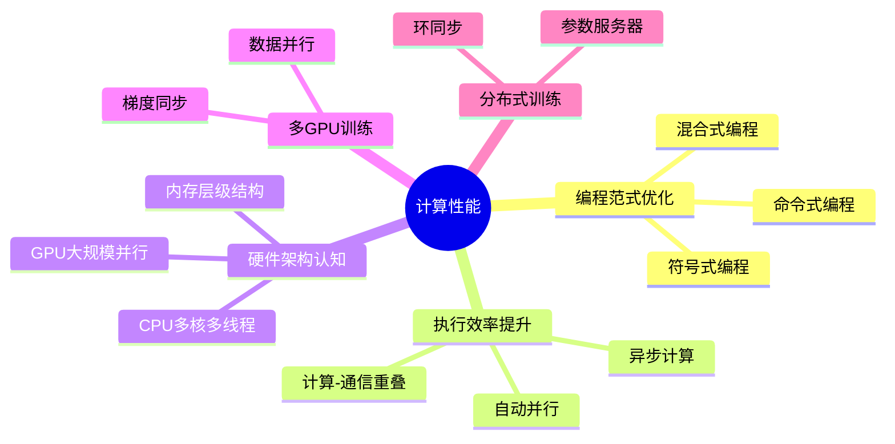

# 计算性能

## 脑图

## 背景

深度学习的模型规模和数据集规模持续膨胀，**计算开销**已成为制约模型迭代速度的核心瓶颈。传统的同步执行模式和单设备训练方式无法满足大规模训练需求。与此同时，硬件架构日益复杂——**CPU多核化**、**GPU大规模并行**、**内存层级**和**网络带宽**的差异，要求软件层面必须进行针对性优化。从编程范式、执行策略到分布式架构，计算性能优化已成为深度学习工程落地的关键能力。

## 问题

- **命令式编程效率低**：逐步解释执行，无法进行全局优化，计算速度受限
- **同步执行导致资源空闲**：CPU等待GPU完成计算，计算单元利用率不足
- **计算与通信互相阻塞**：数据传输和计算无法重叠，隐藏延迟困难
- **单GPU容量不足**：大模型或大数据集无法在单设备上完成训练
- **多机梯度同步成为瓶颈**：分布式训练中通信开销随规模增长，成为性能天花板

## 解决方案

### 编程范式：混合式编程

**命令式编程**（如PyTorch默认模式）灵活易调试，但每次操作都需解释执行，无法进行跨操作的全局优化。**符号式编程**（如早期TensorFlow）先构建完整计算图再编译执行，可进行图优化，但调试困难。**混合式编程**取两者之长：前端用命令式编写代码保持灵活性，后端将代码编译为符号式计算图执行以获得性能提升。

### 执行策略：异步与并行

**异步计算**将计算任务推入后端队列，CPU不必等待GPU返回结果即可继续提交后续任务，通过**障碍器**和**阻塞器**在必要时强制同步，避免数据竞争。**自动并行**利用GPU硬件能力，让计算与数据传输**重叠执行**，隐藏通信延迟。

### 多GPU扩展：数据并行

**数据并行**是多GPU训练的核心范式：将数据拆分到多个GPU，每个GPU独立计算梯度，然后**同步梯度**并更新参数。框架内置API可将实现简化为极少代码。

### 分布式训练：参数服务器与环同步

**环同步**将GPU组成环形拓扑，梯度沿环传递，每个节点只与相邻节点通信，避免中心节点的带宽瓶颈。**参数服务器**采用集中式或分布式的键值存储管理参数，支持灵活的多机训练拓扑，可扩展到大规模分布式场景。

### 方案对比

| 维度 | 命令式编程 | 符号式编程 | 混合式编程 |
|------|-----------|-----------|-----------|
| 灵活性 | 高 | 低 | 高 |
| 调试便利性 | 高 | 低 | 高 |
| 执行效率 | 低 | 高 | 高 |
| 全局优化能力 | 无 | 有 | 有 |

| 维度 | 数据并行 | 模型并行 |
|------|---------|---------|
| 拆分方式 | 按数据样本拆分 | 按模型层/参数拆分 |
| 通信内容 | 梯度同步 | 中间激活值 |
| 适用场景 | 数据量大、模型可装入单GPU | 模型过大、单GPU装不下 |
| 扩展性 | 近线性加速 | 受模型结构限制 |

## 效果

- **混合式编程**在保持编程灵活性的同时，可获得接近符号式编程的执行速度，是现代深度学习框架的主流范式
- **异步计算**通过消除CPU-GPU等待间隙，显著提升设备利用率
- **计算-通信重叠**将通信延迟隐藏在计算过程中，是高性能训练的基础技术
- **数据并行**使训练速度随GPU数量**近线性提升**，是横向扩展训练能力的标准手段
- **环同步和参数服务器**将分布式训练扩展到数百甚至数千设备，使大模型训练成为可能

## 核心框架

| 概念 | 作用 | 关键特性 |
|------|------|---------|
| 混合式编程 | 编译期优化计算图 | 前端命令式 + 后端符号式 |
| 异步计算 | 消除设备间等待 | 队列化任务提交 + 按需同步 |
| 自动并行 | 隐藏通信延迟 | 计算与传输重叠执行 |
| 数据并行 | 多GPU训练 | 梯度同步 + 参数更新 |
| 环同步 | 高效梯度聚合 | 环形拓扑 + 邻居通信 |
| 参数服务器 | 分布式参数管理 | 键值存储 + 灵活拓扑 |
