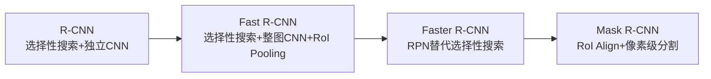

# 计算机视觉

## 背景

**计算机视觉**是深度学习最早取得突破性成果的领域之一。2012年 **AlexNet** 在 ImageNet 竞赛中大幅领先传统方法，标志着深度学习时代的开启。此后，**卷积神经网络（CNN）** 成为视觉任务的核心工具。然而，实际应用中面临三个根本性挑战：标注数据稀缺导致模型泛化能力不足；图像中目标的尺度、位置、数量高度不确定；像素级理解任务要求输出与输入在空间上精确对应。这些挑战催生了图像增广、迁移学习、目标检测和语义分割等一系列关键技术。

## 问题

- 标注数据有限时，如何防止**过拟合**并提升模型泛化能力？
- 如何在图像中同时识别目标的**类别**和**位置**，且应对多尺度变化？
- 如何将预训练模型的**通用特征**迁移到特定小规模任务？
- 如何实现**像素级分类**，对图像中每个像素赋予语义标签？
- 如何将一幅图像的**艺术风格**自动迁移到另一幅图像上？

## 解决方案

### 1. 图像增广：用随机变换扩充数据

**图像增广**通过对训练图像施加随机变换来生成新的训练样本，核心目的是**减少模型对特定属性的依赖**。例如，随机裁剪让模型不再依赖目标出现在固定位置，颜色抖动让模型不再依赖特定色调。

常用方法分为两类：**几何变换**（翻转、裁剪、旋转）和**颜色变换**（亮度、对比度、饱和度、色调）。多种方法可组合使用。关键原则是增广**仅在训练阶段使用**，预测时保持确定性输入。

### 2. 微调：从小数据集借力大规模预训练

**迁移学习**的核心思想是：在大规模数据集（如 ImageNet）上训练的模型已经学会了提取**通用视觉特征**——边缘、纹理、形状、物体组合——这些知识可以迁移到新任务。

**微调**是迁移学习的具体实现，分四步：(1) 在源数据集上获得**预训练模型**；(2) 复制模型架构和参数到目标模型，**替换输出层**以匹配目标类别数；(3) 用较大学习率**从头训练输出层**；(4) 用较小学习率**微调**其余层的参数。

微调之所以有效，是因为深层网络中**浅层学到通用特征**（边缘、纹理），**深层学到任务相关特征**，通用特征在不同任务间高度可复用。

### 3. 目标检测：定位与识别的统一

**目标检测**同时解决"图中有什么"和"在哪里"两个问题。这引出了几个核心机制：

**边界框**用4个数值描述目标位置，有两种表示法：**左上-右下坐标**（直觉清晰）和**中心-宽高**（便于锚框生成和偏移量计算）。

**锚框**是以每个像素为中心、预设多种尺度和宽高比的候选框。通过 **IoU（交并比）** 度量锚框与真实框的重叠程度，将锚框标注为正样本（匹配某目标）或负样本（背景）。预测后通过**非极大值抑制（NMS）** 按置信度排序，移除高度重叠的冗余框，保留最可靠的检测结果。

**多尺度检测**利用 CNN 的分层特征：浅层特征图分辨率高、感受野小，适合检测**小目标**；深层特征图分辨率低、感受野大，适合检测**大目标**。

### 4. SSD vs R-CNN：两种检测范式

目标检测器分为两大范式，核心区别在于是否将"区域生成"和"分类回归"分离：

| 维度 | 单阶段检测器（SSD） | 两阶段检测器（R-CNN系列） |
|------|-------------------|------------------------|
| 核心思想 | 一次前向传播同时完成定位与分类 | 先生成候选区域，再对区域分类回归 |
| 速度 | 快 | 较慢 |
| 精度 | 略低 | 通常更高 |
| 代表模型 | SSD、YOLO | R-CNN、Fast R-CNN、Faster R-CNN |

**SSD** 在骨干网络之上叠加多尺度特征块，每一层生成不同尺度的锚框并直接预测类别和偏移量，实现**端到端单阶段检测**。

**R-CNN 系列**的演进体现了"逐步端到端"的趋势：

- **R-CNN**：用选择性搜索生成约2000个候选区域，每个区域独立过CNN——计算冗余极大
- **Fast R-CNN**：整图过一次CNN，用 **RoI Pooling** 从特征图上为不同形状的区域抽取固定大小特征——消除重复计算，但区域生成仍依赖外部算法
- **Faster R-CNN**：用**区域提议网络（RPN）** 替代选择性搜索。RPN 在特征图上以每个位置为中心生成锚框，预测前景/背景和偏移量，与整个网络**联合训练**，实现真正的端到端
- **Mask R-CNN**：将 RoI Pooling 替换为 **RoI Align**（双线性插值保留空间精度），增加分割分支实现实例分割

### 5. 语义分割：像素级理解

**语义分割**为图像中每个像素分配语义类别标签。与目标检测的边界框相比，它提供更精细的区域划分；与**实例分割**相比，它不区分同类别的不同个体。

实现语义分割的关键技术是**全卷积网络（FCN）**，其设计思想是将分类网络转化为分割网络：

1. **移除**分类网络末尾的全连接层和全局池化层，保留卷积特征提取
2. 用 **1x1 卷积**将通道数映射为类别数
3. 用**转置卷积**将特征图上采样至原始分辨率

**转置卷积**（也称反卷积）是卷积的"逆操作"——普通卷积缩小空间尺寸，转置卷积恢复空间尺寸。从矩阵角度看，若卷积对应矩阵乘法 Wx，转置卷积对应 W^T x。它是语义分割中从低分辨率特征恢复像素级预测的核心工具。

### 6. 风格迁移：特征空间的艺术重组

**风格迁移**将风格图像的艺术特征（笔触、色彩分布）迁移到内容图像上，同时保留内容图像的结构。

核心方法基于预训练的 **VGG 网络**提取特征，通过优化合成图像最小化三类损失：

- **内容损失**：合成图像与内容图像在深层特征上的差异——保留语义结构
- **风格损失**：合成图像与风格图像在 **Gram 矩阵**上的差异——Gram 矩阵通过通道间内积捕捉特征的统计相关性，表达的是"不同滤波器响应之间的共现模式"，与空间位置无关
- **全变分损失**：抑制高频噪声，使合成图像平滑

训练过程中，合成图像是唯一需要更新的参数，通过反向传播迭代优化得到最终结果。

## 效果

这些技术带来了本质性改变：

- **图像增广**使小数据集上训练的模型也能获得良好泛化，AlexNet 的成功离不开增广
- **微调**让小数据集任务也能获得高性能（热狗识别准确率从 84.3% 提升至 93.9%），大幅降低了深度学习的应用门槛
- **目标检测**从 R-CNN 的每张图数十秒到 Faster R-CNN 的实时检测，**端到端训练**成为标准范式
- **FCN** 证明了分类网络可以转化为分割网络，**转置卷积**成为语义分割的标准上采样工具
- **风格迁移**展示了 CNN 特征表示的**可分解性**——内容和风格可以被独立提取和重组

## 核心框架

| 技术 | 核心作用 | 关键特性 |
|------|---------|---------|
| 图像增广 | 数据层面的正则化 | 随机变换、仅训练时使用 |
| 微调 | 小数据集上的迁移学习 | 复用预训练特征、分层学习率 |
| 锚框 | 目标检测的区域采样 | 多尺度多宽高比、IoU匹配 |
| NMS | 检测结果去重 | 按置信度排序、移除高IoU冗余框 |
| RPN | 可训练的区域生成 | 替代选择性搜索、端到端训练 |
| RoI Pooling/Align | 从特征图提取区域特征 | 统一不同尺寸区域的特征表示 |
| 转置卷积 | 特征图上采样 | 卷积的转置操作、恢复空间分辨率 |
| FCN | 语义分割基础架构 | 1x1卷积+转置卷积、像素级预测 |
| Gram矩阵 | 风格特征表示 | 通道间相关性、与空间位置无关 |
