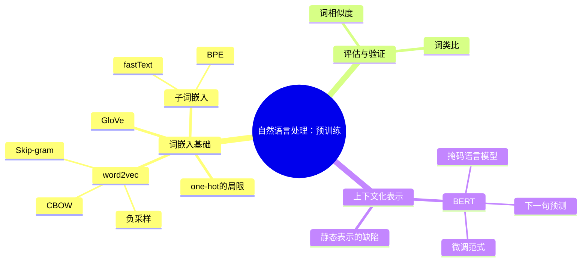
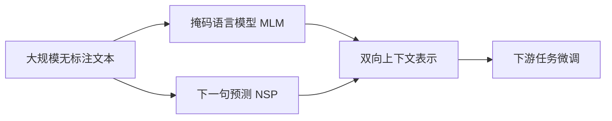

# 自然语言处理：预训练

## 脑图

## 背景

自然语言是人类最复杂的信息载体，而计算机只能处理数值。**词嵌入**（word embedding）的核心思想是将离散的词符号映射为连续的稠密向量，使计算机能够度量词与词之间的语义关系。早期的**独热向量**表示将每个词编码为一个正交基向量，任意两个不同词的相似度恒为零——这从根本上否定了语义相似性的存在。2013年提出的**word2vec**开启了用神经网络从大规模无标注文本中自监督学习词表示的时代，随后**GloVe**、**fastText**、**BERT**等方法不断演进，逐步解决了静态表示、形态变化、多义词等核心难题，最终形成了"**预训练+微调**"的现代NLP范式。

## 问题

- **独热向量无法编码语义关系**：任意两词的相似度为零，模型无法利用词与词之间的相似性
- **计算瓶颈**：词汇表动辄数十万，全词表softmax的梯度计算代价不可承受
- **静态表示无法处理多义词**：同一个词在不同语境中含义不同，但传统词嵌入只给一个固定向量
- **未登录词和稀有词**：训练语料中未出现或极少出现的词无法获得有意义的表示
- **如何从海量无标注文本中提取通用语言知识**：标注数据昂贵且稀缺，需要一种可扩展的预训练方式

## 解决方案

### 从独热到稠密：词嵌入的诞生

**word2vec** 的核心前提是**分布式假说**——词的语义由其上下文决定。它为每个词学习两个向量（中心词向量和上下文词向量），通过预测关系将语义相近的词映射到向量空间中的邻近位置。

两种训练策略的本质区别：

| 策略 | 输入 | 预测目标 | 核心思想 |
|------|------|----------|----------|
| **Skip-gram** | 中心词 | 上下文词 | 用一个词去"生成"它的邻居 |
| **CBOW** | 上下文词 | 中心词 | 用邻居的平均去"还原"中心词 |

Skip-gram适合稀有词（每个词独立训练），CBOW适合高频词（上下文平均平滑噪声）。

### 突破计算瓶颈：负采样

全词表softmax需要对数十万个词求和，每次梯度计算复杂度为O(N)。**负采样**将问题转化为：从真实上下文中区分出少量随机采样的"噪声词"。这把O(N)的全局归一化降为O(k)的二分类（k通常为5-20），训练速度快了几个数量级，且学到的向量质量几乎不受影响。

### 全局视角：GloVe

word2vec只利用局部窗口内的共现信息。**GloVe**（Global Vectors）则预先统计整个语料库中词对的共现次数，让词向量的点积去拟合共现计数的对数。其关键洞见是：**共现概率的比值**天然编码了语义关系——"ice"与"solid"的共现概率远高于"steam"与"solid"（比值约8.9），而与两者都相关的"water"比值接近1。GloVe用平方损失替代交叉熵，训练更稳定，且共现矩阵可预计算，训练效率更高。

### 捕捉形态：子词嵌入

word2vec和GloVe将每个词视为原子单位，形态相似的词（helps、helped、helping）拥有完全独立的向量。**子词嵌入**将词拆分为更小的单元，使形态相似的词共享子词参数。

| 方法 | 拆分策略 | 词表大小 | 核心优势 |
|------|----------|----------|----------|
| **fastText** | 固定长度字符n-gram | 预设 | 罕见词和未登录词也能获得向量 |
| **BPE** | 迭代合并高频符号对 | 固定 | 可变长度子词，被GPT-2、RoBERTa采用 |

### 从静态到动态：BERT

上述所有方法产生**上下文无关**的表示——"bank"在"去银行存钱"和"坐在河岸边"中获得完全相同的向量。这在多义词场景下是根本性缺陷。

**BERT**（Bidirectional Encoder Representations from Transformers）基于**Transformer编码器**，使每个词元的表示同时编码左右两侧的上下文信息。它通过两个自监督预训练任务从无标注文本中学习：

**掩码语言模型（MLM）**：随机遮蔽15%的词元，让模型从上下文中预测被遮蔽的词。这迫使模型同时利用左侧和右侧的信息，突破了GPT单向注意力的限制。被遮蔽词元的处理策略（80%替换为`[MASK]`、10%替换为随机词、10%保持不变）避免了预训练与微调之间的分布不匹配。

**下一句预测（NSP）**：判断两句话是否相邻，训练模型理解句子间的关系。利用`[CLS]`标记的表示进行二分类。

**微调范式**：预训练完成后，BERT只需在下游任务的标注数据上少量训练即可适配。序列级任务（如情感分析）利用`[CLS]`的表示，词元级任务（如命名实体识别）利用每个位置的表示。一个预训练模型，最小化架构改动，覆盖多种下游任务。

## 效果

**词嵌入从根本上改变了NLP的技术范式**。在此之前，NLP任务依赖手工特征和任务专属模型；在此之后，通用的预训练表示成为基础设施。

具体而言：

- **语义关系可计算**：词向量的算术运算能够捕捉语义类比关系（"国王-男人+女人≈女王"），证明向量空间中的几何结构与语言结构之间存在深层对应
- **数据效率飞跃**：预训练将海量无标注文本中的语言知识压缩为向量表示，下游任务只需少量标注数据即可达到高性能
- **上下文化表示消除多义词歧义**：BERT使同一词元在不同语境中获得不同表示，从根本上解决了静态词嵌入的多义词问题
- **统一架构覆盖多种任务**：BERT证明了一个预训练模型可以通过最小化微调适配分类、序列标注、语义匹配等截然不同的任务，奠定了"预训练+微调"的现代NLP范式
- **子词机制解决了开放词汇问题**：BPE和fastText使模型能够处理任意未登录词，不再受限于固定词汇表

## 核心框架

| 概念 | 作用 | 关键特性 |
|------|------|----------|
| **词嵌入** | 将离散词映射为稠密向量 | 分布式假说，语义由上下文决定 |
| **Skip-gram / CBOW** | 通过预测关系学习词向量 | 局部上下文窗口，自监督训练 |
| **负采样** | 近似softmax，降低计算复杂度 | 从全局归一化降为局部二分类 |
| **GloVe** | 融合全局共现统计 | 共现概率比值编码语义关系 |
| **子词嵌入** | 处理形态变化和未登录词 | 子词参数共享，开放词汇表 |
| **词嵌入评估** | 验证向量质量 | 词相似度 + 词类比任务 |
| **BERT** | 上下文化双向表示 | Transformer编码器 + MLM + NSP |
| **预训练+微调** | 通用NLP范式 | 一个预训练模型适配多种下游任务 |
