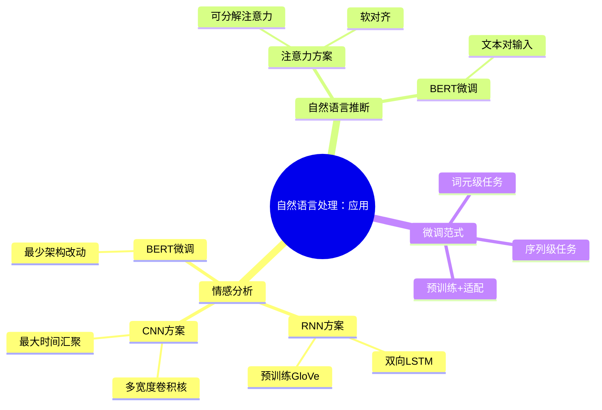

# 自然语言处理：应用

## 脑图

## 背景

2014年至2018年间，NLP领域经历了从**手工特征工程**到**端到端深度学习**再到**预训练+微调**的范式跃迁。早期方法依赖人工设计的文本特征（TF-IDF、n-gram），深度学习引入了**RNN**和**CNN**来自动学习文本表示，而**BERT**的出现则将这一范式推向顶点——在海量无标注文本上预训练通用语言表示，再用少量标注数据微调适配具体任务。本章的核心问题是：**已有强大的预训练文本表示，如何将其有效地应用于下游NLP任务？** 章节以**情感分析**和**自然语言推断**两个经典任务为载体，展示了从RNN到CNN到BERT的完整技术演进路径。

## 问题

- 如何将**变长文本序列**映射为**固定维度的类别标签**（文本分类）
- 如何用**局部特征**高效捕捉文本中的**关键情感信号**（局部语义建模）
- 如何判断**两段文本之间的逻辑关系**（蕴含、矛盾、中性）
- 如何将**通用预训练表示**高效适配到**不同粒度的下游任务**
- 在**资源受限**时，如何在**模型性能**和**计算成本**之间取得平衡

## 解决方案

### 问题一：文本序列到类别标签的映射

**RNN方案**的核心思想是将文本视为**时序信号**。用预训练的**GloVe词向量**将每个词元映射为稠密向量，送入**双向LSTM**捕捉前后文依赖，取初始和最终时间步的隐状态拼接后通过全连接层分类。双向设计确保模型同时看到"我 这部 电影 非常 喜欢"中"喜欢"的左上下文和右上下文。预训练词向量在训练中**保持冻结**，借助大规模语料的先验知识减少过拟合。

**CNN方案（TextCNN）**的核心洞见是：文本可以被视为**一维图像**。一维卷积核在文本上滑动，本质上是在提取**局部n-gram特征**。关键设计包括：

- **多宽度卷积核**：同时使用宽度为3、4、5的卷积核，分别捕获三元组、四元组、五元组级别的局部模式
- **最大时间汇聚**：从每个卷积通道中提取最显著的特征，将变长输出压缩为固定长度
- **双通道嵌入**：一个可训练、一个冻结的词向量层并行工作，兼顾任务适应性和预训练知识

### 问题二：两段文本之间的逻辑关系判断

**可分解注意力方案**将推断过程拆分为三个步骤，无需RNN或CNN：

1. **注意（Attending）**：通过注意力机制将前提中的每个词元与假设中的每个词元**软对齐**，用加权平均聚合关联信息。关键的分解技巧将计算复杂度从二次降为线性。
2. **比较（Comparing）**：将每个词元与其软对齐后的对应信息拼接比较，生成比较向量。
3. **聚合（Aggregating）**：将两组比较向量分别求和后拼接，通过MLP输出三分类结果。

这一方案的核心价值在于证明：**仅靠注意力和MLP就能完成跨文本推断**，不需要序列建模结构。

### 问题三：通用预训练到下游任务的适配

**BERT微调方案**体现了"预训练+微调"范式的简洁与强大：

- **序列级任务**（如情感分析）：取BERT输出中特殊`[CLS]`标记的隐藏状态作为整个序列的汇总表示，接一个MLP分类头即可
- **词元级任务**（如命名实体识别）：利用每个词元位置的隐藏状态进行逐词元预测
- **文本对任务**（如自然语言推断）：将前提和假设打包为单一输入序列，用片段索引区分两者，截断策略为持续移除较长文本的尾部标记直到满足长度限制

微调时，BERT编码器的**全部参数参与更新**，但预训练阶段的MaskLM和NextSentencePred相关参数成为**陈旧参数**不再更新，仅新增的输出层参数从零开始学习。

### 方案对比

| 维度 | RNN方案 | CNN方案（TextCNN） | 注意力方案 | BERT微调 |
|------|---------|-------------------|-----------|----------|
| **核心机制** | 双向LSTM序列编码 | 多宽度一维卷积+最大汇聚 | 可分解注意力软对齐 | 预训练Transformer编码器 |
| **特征捕捉** | 长距离序列依赖 | 局部n-gram模式 | 跨文本词元对齐 | 全局双向上下文 |
| **计算特点** | 顺序计算，难以并行 | 卷积并行，效率高 | 线性复杂度注意力 | 大量参数，计算密集 |
| **数据需求** | 需预训练词向量辅助 | 双通道词向量辅助 | 需预训练词向量辅助 | 预训练模型自带知识 |
| **适用场景** | 资源受限，需序列建模 | 资源受限，需高效推理 | 文本对推理任务 | 数据充足，追求最优性能 |

## 效果

**预训练+微调成为NLP的标准范式**。本章展示了一个清晰的技术演进路径：从需要精心设计架构的RNN/CNN方案，到只需最少架构改动的BERT微调。这一演进的本质改变是——**模型设计的重心从"如何提取特征"转移到"如何适配预训练表示"**。

**架构选择取决于约束条件**。BERT微调在性能上占优，但需要微调大量参数，计算成本高。当资源受限时，精心设计的CNN或RNN模型**更具可行性**。TextCNN通过多宽度卷积核和最大汇聚实现了高效的局部特征提取，而可分解注意力方案则以极简架构完成了跨文本推断。

**不同架构各有不可替代的优势**。CNN擅长捕捉**局部模式**，RNN擅长建模**序列依赖**，注意力擅长实现**跨文本对齐**，BERT则提供了**全局双向上下文表示**。理解这些架构的本质差异，比记住具体实现细节更重要。

## 核心框架

| 概念 | 作用 | 关键特性 |
|------|------|----------|
| **预训练词向量（GloVe）** | 提供词元的稠密语义表示 | 大规模语料训练，迁移学习基础 |
| **双向LSTM** | 捕捉文本的前后文序列依赖 | 顺序计算，隐状态拼接表征全文 |
| **TextCNN** | 提取文本的局部n-gram特征 | 多宽度卷积核并行，最大汇聚压缩 |
| **可分解注意力** | 实现两文本间词元的软对齐 | 线性复杂度，无需序列建模结构 |
| **BERT微调** | 将通用预训练表示适配到具体任务 | 最少架构改动，全参数端到端更新 |
| **[CLS]标记** | 提供序列级任务的汇总表示 | BERT输入的特殊分类标记 |
| **片段索引** | 区分文本对中的两个输入序列 | 用于NLI等文本对任务 |
