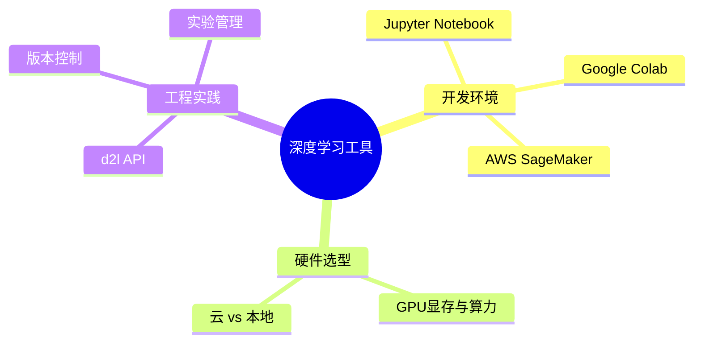

# 深度学习工具

## 脑图

## 背景

深度学习研究的核心循环是"**提出假设 → 编写实验 → 观察结果 → 迭代改进**"，这个循环的快慢直接决定了研究产出效率。没有合适的开发环境，一次实验启动就要耗费数小时配置依赖和硬件；没有合适的计算资源，一个本该跑几小时的实验可能要等几天。**工具链**不是锦上添花，而是深度学习实践的基础设施——它决定了你能否把注意力集中在模型本身，而不是被环境问题反复打断。

## 问题

- 如何快速搭建**交互式**深度学习开发环境？
- 没有本地GPU时，如何获得**云端算力**？
- 本地机器与云服务之间如何**选择**？
- 如何根据任务需求选对**GPU型号**？
- 如何用统一API减少**重复代码**？
- 如何参与开源项目并进行**版本协作**？

## 解决方案

### 开发环境：Jupyter Notebook

**Jupyter Notebook** 将代码、输出、可视化和文字说明组织在一个文档中，天然适合深度学习的**探索式编程**模式。你可以逐单元格运行，即时观察中间结果，快速定位问题。本地运行需要安装环境并配置端口；远程运行则通过SSH隧道将服务器上的Notebook映射到本地浏览器。

### 云端算力：SageMaker 与 EC2

**AWS SageMaker** 提供托管式Notebook环境，省去环境配置，按需启停实例，适合快速启动实验。**EC2** 则提供完整的虚拟机控制权，需要自行安装CUDA和深度学习库，但灵活性更高，适合需要定制化环境的场景。

### 本地 vs 云端

| 维度 | 本地 | 云端 |
|------|------|------|
| 初始成本 | 高（购买硬件） | 低（按需付费） |
| 长期成本 | 低 | 高（持续使用时） |
| 灵活性 | 受限于已有硬件 | 随时更换GPU型号 |
| 数据传输 | 无 | 需上传/下载数据 |
| 适用阶段 | 长期稳定使用 | 临时实验、原型验证 |

### GPU选型

选GPU的核心考量是**显存容量**和**算力**。显存决定了能训练多大的模型和batch size，算力决定了训练速度。入门级GPU适合学习和小模型实验；专业级GPU适合中等规模训练；云端高端实例适合大模型和大规模训练。**不要盲目追求最强GPU**，根据实际任务规模选择即可。

### d2l API

`d2l` 库封装了本书中反复使用的**数据加载**、**模型定义**、**训练循环**和**可视化工具**。它的价值在于：统一接口减少样板代码，让读者聚焦于算法本身的学习，而不是重复编写数据预处理和训练循环。

## 效果

- **Jupyter Notebook** 将实验迭代周期从"编写-运行-查看日志"缩短为"修改-Shift+Enter-即时反馈"，**实验速度提升一个数量级**
- **云端算力**消除了硬件门槛，让任何有网络的研究者都能使用GPU，**算力民主化**
- **合理的GPU选型**避免资源浪费或瓶颈，让投入产出比最大化
- **d2l API** 将每次实验的样板代码从几十行压缩到几行，**认知负担大幅降低**

## 核心框架

| 工具/概念 | 解决的问题 | 核心价值 |
|-----------|-----------|---------|
| Jupyter Notebook | 交互式开发 | 即时反馈，探索式编程 |
| AWS SageMaker | 免配置云端环境 | 快速启动，按需付费 |
| AWS EC2 | 定制化云端环境 | 完全控制，灵活配置 |
| GPU选型 | 硬件资源匹配 | 显存与算力的平衡 |
| d2l API | 重复代码消除 | 统一接口，聚焦算法 |
| 开源贡献 | 知识协作 | 版本控制，社区共建 |
