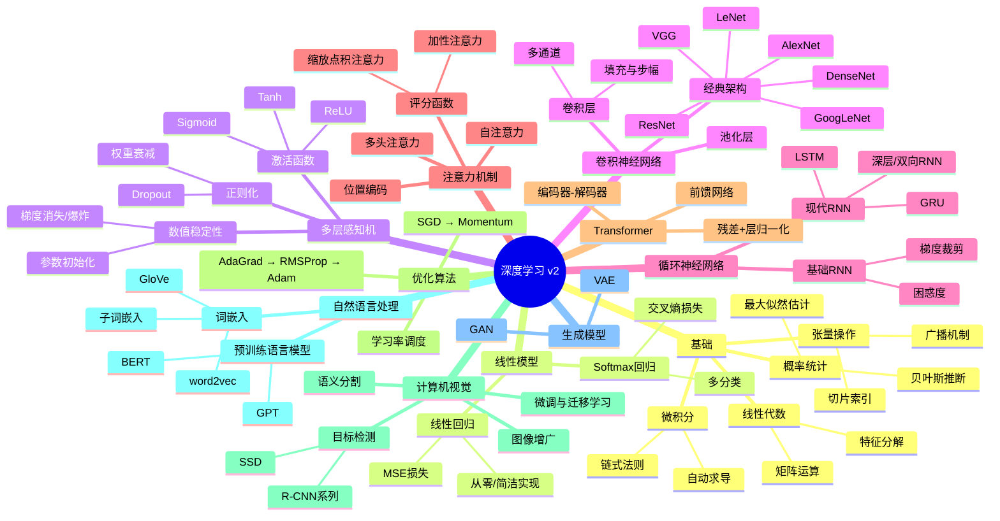

# 《动手学深度学习》v2 — 全书精华

## 20 个核心概念

- **张量**：多维数组，深度学习计算的基本数据单元
- **自动求导**：自动计算梯度的机制，反向传播的基础设施
- **损失函数**：衡量预测值与真实值差距的标量函数
- **梯度下降**：沿梯度反方向迭代更新参数以最小化损失
- **反向传播**：利用链式法则从输出层到输入层高效计算梯度
- **激活函数**：引入非线性变换，如ReLU、Sigmoid、Tanh
- **过拟合**：模型在训练集表现好但泛化能力差的现象
- **正则化**：约束模型复杂度以减轻过拟合的技术集合
- **卷积**：局部连接与权值共享，提取空间局部特征
- **池化**：降低特征图分辨率，增强平移不变性
- **循环神经网络**：具有隐状态的序列建模架构
- **门控机制**：GRU/LSTM中控制信息遗忘与保留的结构
- **注意力机制**：动态计算输入各位置对当前输出的权重
- **Transformer**：纯注意力架构，抛弃循环，完全并行
- **批量归一化**：稳定各层输入分布以加速训练收敛
- **残差连接**：跳跃连接解决深层网络退化与梯度消失
- **Dropout**：训练时随机丢弃神经元以防止过拟合
- **词嵌入**：将离散词元映射为稠密连续向量表示
- **迁移学习**：在大规模数据上预训练，再微调到下游任务
- **数据增强**：对训练样本做随机变换以扩充数据集规模

## 20 个核心思想

- **数据驱动**：让模型从数据中学习规律，而非手工编程规则
- **表示学习**：让模型自动发现对任务有用的特征表示
- **端到端学习**：从原始输入直接映射到最终输出，无需人工特征工程
- **层次化特征**：浅层学边缘纹理，深层学语义概念，逐层抽象
- **归纳偏置**：模型结构本身蕴含的先验假设，如CNN的局部性
- **偏差-方差权衡**：模型复杂度需在欠拟合与过拟合间取得平衡
- **参数共享**：同一参数处理不同位置，大幅减少模型参数量
- **近似定理**：足够宽的单隐层网络可逼近任意连续函数
- **梯度消失与爆炸**：深层网络训练中的核心数值稳定性挑战
- **稀疏激活**：ReLU等函数使部分神经元输出为零，降低计算耦合
- **缩放定律**：模型性能随数据量、参数量、算力的幂律增长
- **多头注意力**：并行多组注意力捕获不同子空间的依赖关系
- **位置编码**：为Transformer注入序列顺序信息的数学机制
- **迁移学习**：预训练学到通用表示，微调适配特定任务
- **自监督学习**：从无标注数据中构造伪标签进行预训练
- **对抗鲁棒性**：微小扰动可欺骗模型，暴露表示的脆弱性
- **知识蒸馏**：用大模型的软标签指导小模型学习压缩知识
- **数据增强**：通过变换扩充数据分布，是低成本的正则化手段
- **模型集成**：多个模型的预测聚合通常优于单模型
- **计算图**：将前向传播建模为有向图，是自动求导的理论基础

## 深度学习架构演进

| 架构 | 年代 | 解决的问题 | 核心创新 | 关键局限 |
|------|------|-----------|---------|---------|
| Perceptron | 1958 | 线性二分类 | 单层权重加阈值 | 无法解决XOR等非线性问题 |
| MLP | 1986 | 非线性分类与回归 | 隐藏层+反向传播 | 全连接参数量大，无结构先验 |
| CNN | 1998 | 图像等空间数据 | 局部连接+权值共享+池化 | 对长距离依赖建模能力弱 |
| RNN | 1990s | 序列与时间序列数据 | 隐状态传递时序信息 | 梯度消失，难以捕捉长期依赖 |
| LSTM | 1997 | 长序列中的长期依赖 | 输入/遗忘/输出门控机制 | 序列计算无法并行，训练慢 |
| Attention | 2014 | 序列中动态聚焦关键信息 | 加权求和替代固定表示 | 配合RNN使用仍有并行瓶颈 |
| Transformer | 2017 | 完全并行的序列建模 | 自注意力+位置编码+FFN | 计算和内存复杂度为序列长度的平方 |

## 优化算法对比

| 算法 | 核心思想 | 优势 | 局限 |
|------|---------|------|------|
| SGD | 沿负梯度方向更新参数 | 简单直观，泛化性好 | 学习率敏感，易震荡，收敛慢 |
| Momentum | 累积历史梯度作为动量 | 加速收敛，抑制震荡 | 引入额外超参数 |
| AdaGrad | 自适应学习率，稀疏特征大步更新 | 适合稀疏数据 | 学习率单调递减，后期过小 |
| RMSProp | 指数移动平均代替累积平方和 | 解决AdaGrad学习率衰减问题 | 依赖指数衰减率超参数 |
| Adam | 结合Momentum与RMSProp | 自适应学习率+动量，收敛快 | 泛化性有时不如SGD+Momentum |

## 深度学习知识树

## 如果只能记住 10 件事

1. **深度学习 = 表示学习 + 优化**：让模型自动学习特征，通过梯度下降迭代优化参数
2. **反向传播是训练引擎**：链式法则使梯度从输出高效回传至每一层参数
3. **损失函数决定优化方向**：选择合适的损失函数（MSE、交叉熵等）定义了学习目标
4. **过拟合是头号敌人**：必须用正则化、Dropout、数据增强、早停等手段对抗泛化差距
5. **架构匹配数据结构**：CNN利用空间局部性，RNN利用时序依赖，归纳偏置是关键
6. **注意力机制是现代AI基石**：动态聚焦关键信息，Transformer由此诞生并主导当前范式
7. **深度网络训练需要工程技巧**：BatchNorm、残差连接、合理初始化、梯度裁剪缺一不可
8. **数据质量常比模型复杂度更重要**：更好的数据和特征工程往往比更深的网络更有效
9. **迁移学习是实战利器**：大规模预训练+小数据微调，是资源有限时的最优策略
10. **理解原理比记忆代码重要**：掌握"为什么"比记住"怎么写"更能应对新问题
