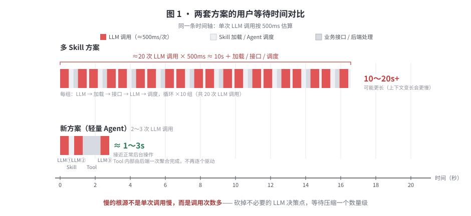
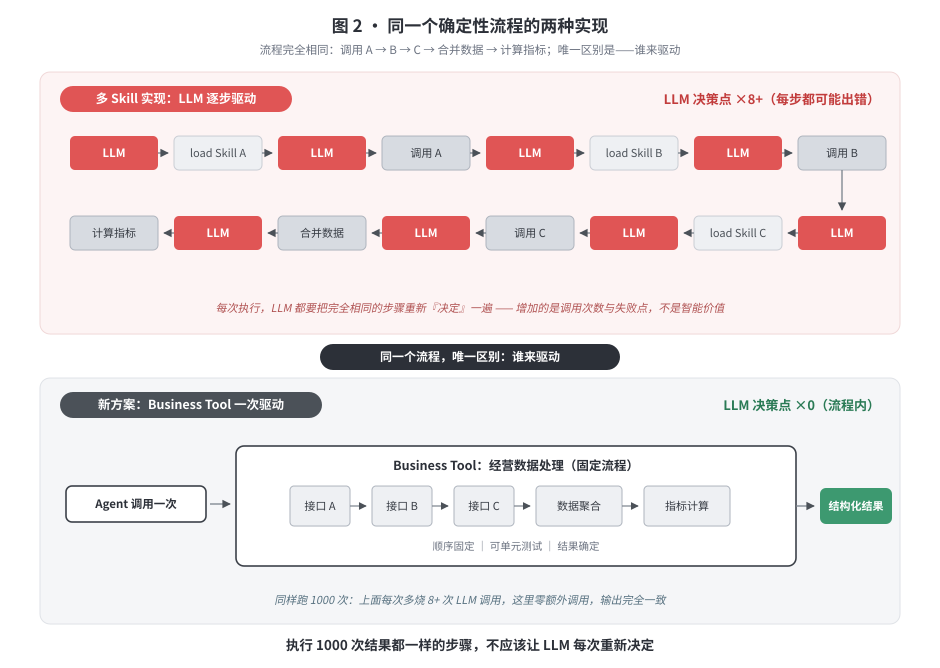
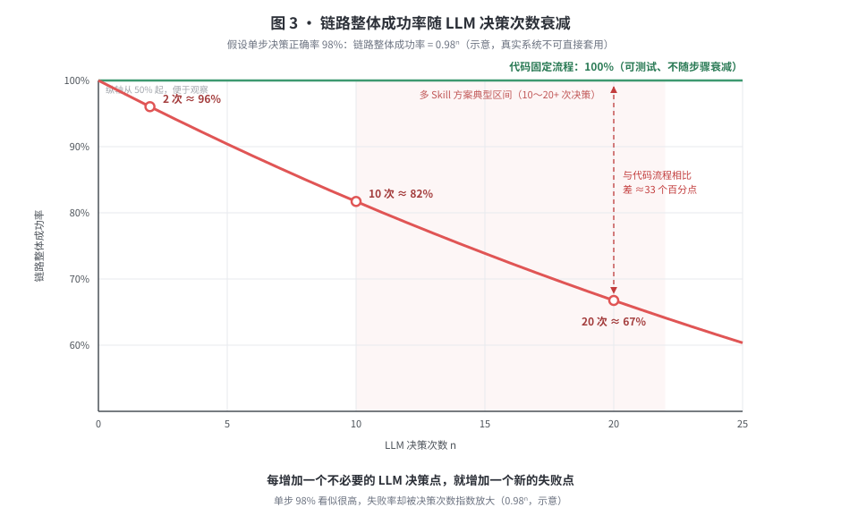
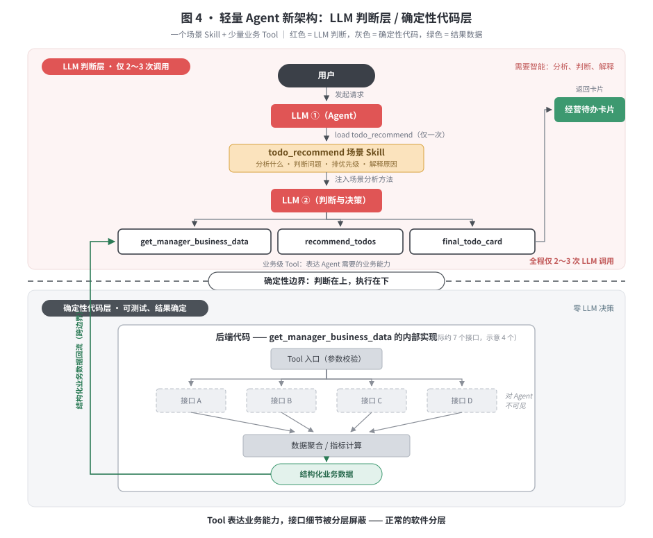
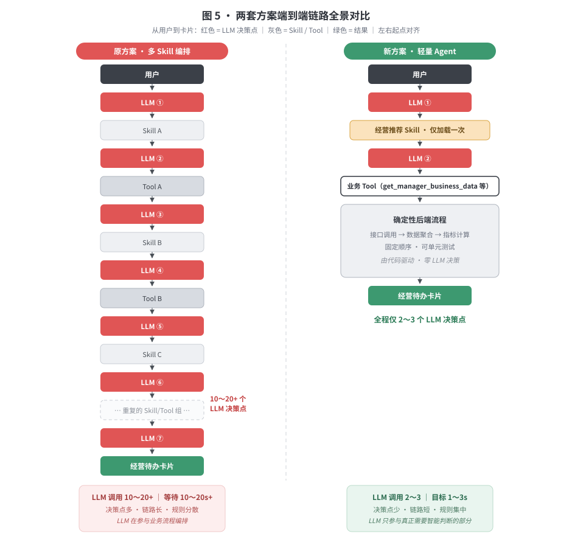

# 经营分析 Agent：为什么要从多 Skill 编排改为轻量 Agent

> 本版只保留"缺了就会影响决策"的内容，并把性能、稳定性和架构差异直接量化对比。

---

## 1. 结论

当前方案需要从：

> **多个 Skill 驱动业务流程**

调整为：

> **1 个场景 Skill + 少量业务 Tool + 后端确定性代码。**

核心原则：

> **需要判断的事情交给 LLM，确定性的事情交给代码。**

目标不是减少 Skill，而是减少没有必要的 LLM 调用。

---

## 2. 为什么之前会有十几个 Skill

之前希望复用公司的 Skill API。

Skill API 内部已经提供 ReAct Agent，但业务方无法灵活：

- 自定义 System Prompt；
- 注册标准业务 Tool；
- 控制 Agent Loop。

我们的业务接口又不是标准 Tool，模型不知道：

- 接口是干什么的？
- 什么时候调用？
- 参数怎么传？

因此只能通过 Skill 告诉模型：

```
加载 Skill
  → 理解接口怎么调用
  → 脚本调用接口
```

这个方案解决了**快速接入 Skill API** 的问题。

但后续把七八个接口、固定处理步骤继续拆成七八个甚至十几个 Skill，就产生了新的问题：

> **一个本来确定性的业务流程，被变成了需要 LLM 一步一步驱动的流程。**

这是当前问题的根源。

---

## 3. 最大的问题：慢

假设一次 LLM 调用平均只需要 500ms。

**多 Skill 方案**

如果完整流程产生 20 次 LLM 调用：

```
20 × 500ms = 10秒
```

再加上：

- Skill 加载
- 业务接口
- 网络调用
- Agent 调度
- 上下文变长后的推理

真实等待时间可能达到 **10～20 秒甚至更高**。

而我们当前前端还是轮询模式，不是 Token 流式输出。

用户看到的就是：

> 点击 → 页面等待十几秒 → 出现结果。

**新方案**

流程收敛为：

```
用户
 ↓
LLM
 ↓
load 经营推荐 Skill
 ↓
LLM
 ↓
调用业务 Tool
 ↓
返回卡片
```

假设只需要 2～3 次 LLM 调用：

```
3 × 500ms = 1.5秒
```

加上业务接口时间，整体仍有机会控制在 **1～3 秒级**。

因此两套方案最直观的区别是：

| | 多 Skill | 新方案 |
| --- | --- | --- |
| LLM 调用 | 10～20+ 次 | 2～3 次 |
| 纯模型耗时（500ms/次） | 5～10s+ | 1～1.5s |
| 用户实际等待 | 可能 10～20s+ | 目标 1～3s |
| 当前交互 | 全程等待 | 接近正常后台操作 |

这是最应该关注的用户体验差异。



---

## 4. 第二个问题：把确定性流程交给 LLM，没有收益

例如业务流程固定是：

```
调用 A
 → 根据结果调用 B
 → 调用 C
 → 合并数据
 → 计算指标
```

如果每次执行顺序都一样，就应该直接写成：

```
Business Tool
   ↓
后端代码
   ├─ A
   ├─ B
   ├─ C
   ├─ 数据聚合
   └─ 指标计算
```

而不是：

```
LLM → load Skill A → LLM → A
→ LLM → load Skill B → LLM → B
……
```

后者增加了大量 LLM 调用，**但没有增加任何智能价值**。



判断标准只有一句：

> **如果执行 1000 次，这一步的处理方式都一样，就不应该让 LLM 每次重新决定。**

---

## 5. 第三个问题：链路越长，越不稳定

每一次 LLM 决策都可能出现：

- Skill 选错
- Skill 理解错
- Tool 选错
- 参数错误
- 下一步判断错误

举一个仅用于说明问题的例子。

假设每次模型决策正确率高达 98%：

```
2 次连续正确：  0.98²  ≈ 96%
10 次连续正确：0.98¹⁰ ≈ 82%
20 次连续正确：0.98²⁰ ≈ 67%
```

真实系统当然不能直接用这个数字计算成功率，但它说明一个基本事实：

> **每增加一个不必要的 LLM 决策点，就增加一个新的失败点。**



代码执行固定流程则是**确定性的，并且可以测试**。

因此：

> **能用代码确定执行的，不应该增加一次 LLM 决策。**

---

## 6. 第四个问题：业务规则会越来越散

多 Skill 后，规则最终可能分散在：

- System Prompt
- Skill A
- Skill B
- Skill C
- Skill Script
- 后端代码

需求变更时会出现一个很实际的问题：

> **这条业务规则到底应该改哪里？**

因此需要明确职责：

| 层 | 只负责什么 |
| --- | --- |
| System Prompt | Agent 长期固定的身份、边界、行为约束 |
| Skill | 一个业务场景应该怎么分析 |
| Tool | 给 Agent 提供什么业务能力 |
| 后端代码 | 接口调用、计算、聚合等确定性逻辑 |
| LLM | 综合数据做真正需要智能的判断 |

---

## 7. 新方案

经营待办推荐本质上是一个**业务场景**。

因此只需要一个核心 Skill：

```
todo_recommend
```

它告诉模型：

- 经营待办应该分析什么
- 如何判断问题
- 如何确定优先级
- 什么情况下推荐什么待办
- 如何解释原因

然后给 Agent 提供业务级 Tool，例如：

- `get_manager_business_data`
- `recommend_todos`
- `final_todo_card`

Tool 内部再调用真正的后端接口：

```
Agent
        ↓
get_manager_business_data
        ↓
    后端代码
   ↙  ↓  ↓  ↘
  A   B   C   D
       ↓
 数据聚合/计算
       ↓
 结构化业务数据
```

**Agent 不需要知道下面有几个接口。**



---

## 8. Tool 也不要按后端接口拆

不能从：

> 一个接口一个 Skill

变成：

> 一个接口一个 Tool。

Tool 应该表达的是：

> **Agent 需要什么业务能力。**

例如 Agent 需要：

```
查询资管经理经营数据
```

后端实现这个能力可能需要调用 7 个接口。

对 Agent 仍然只需要暴露：

```
get_manager_business_data
```

这是正常的软件分层。

---

## 9. 两套方案最终对比

**原方案**

```
用户
 ↓
LLM
 ↓
Skill A
 ↓
LLM
 ↓
Tool A
 ↓
LLM
 ↓
Skill B
 ↓
LLM
 ↓
Tool B
 ↓
LLM
 ↓
Skill C
 ↓
……
 ↓
卡片
```

特点：

> **LLM 在参与业务流程编排。**

**新方案**

```
用户
 ↓
LLM
 ↓
经营推荐 Skill
 ↓
LLM
 ↓
业务 Tool
 ↓
确定性后端流程
 ↓
卡片
```

特点：

> **LLM 只参与真正需要智能判断的部分。**



| 对比 | 多 Skill 方案 | 新方案 |
| --- | --- | --- |
| Skill | 十几个步骤级 Skill | 1 个场景级 Skill |
| LLM 调用 | 10～20+ | 2～3 |
| 响应 | 可能 10～20s+ | 目标 1～3s |
| 稳定性 | 决策节点多 | 决策节点少 |
| Token | 高 | 低 |
| 固定流程 | LLM 驱动 | 代码驱动 |
| 业务规则 | 分散 | 职责明确 |
| 调试 | Agent 链路长 | 链路简单 |
| 维护 | 多 Skill 联动 | 场景集中维护 |

---

## 10. 最终原则

我们不是在讨论：

> 1 个 Skill 好，还是 10 个 Skill 好。

真正应该讨论的是：

> **每增加一次 LLM 调用，它到底增加了什么智能价值？**

如果没有，就应该去掉。

最终架构原则只有三条：

1. **一个 Skill 表达一个完整业务场景**，而不是一个接口或一个执行步骤。
2. **Tool 表达 Agent 需要的业务能力**，而不是机械映射后端接口。
3. **不确定性留给 LLM，确定性留给代码。**

对于经营分析 Agent，我们需要的是：

> **用最短的 Agent 链路完成真正有价值的经营判断，而不是把原本简单、确定的业务流程全部 Agent 化。**
